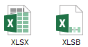
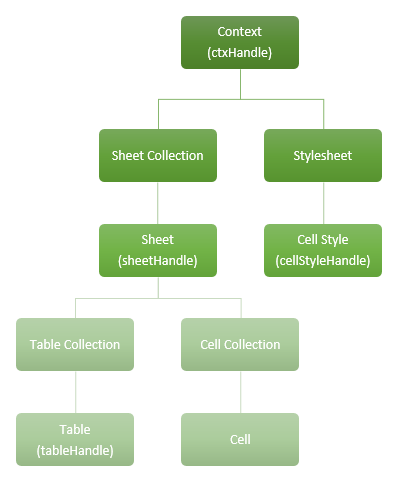
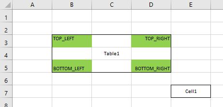
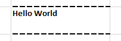
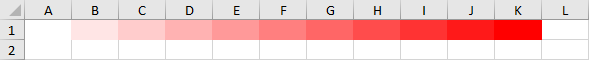
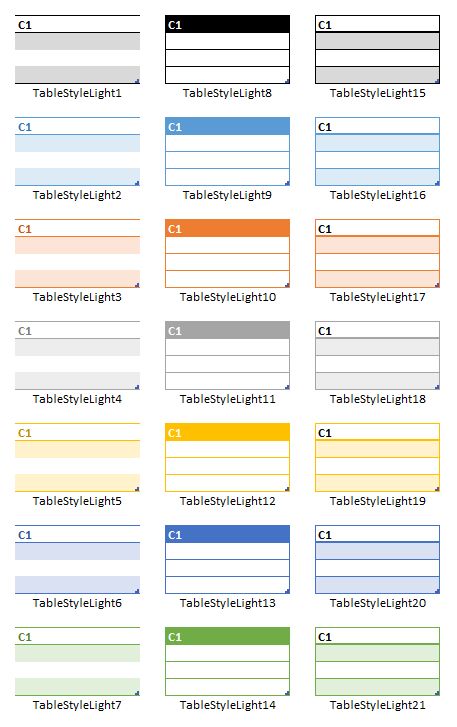
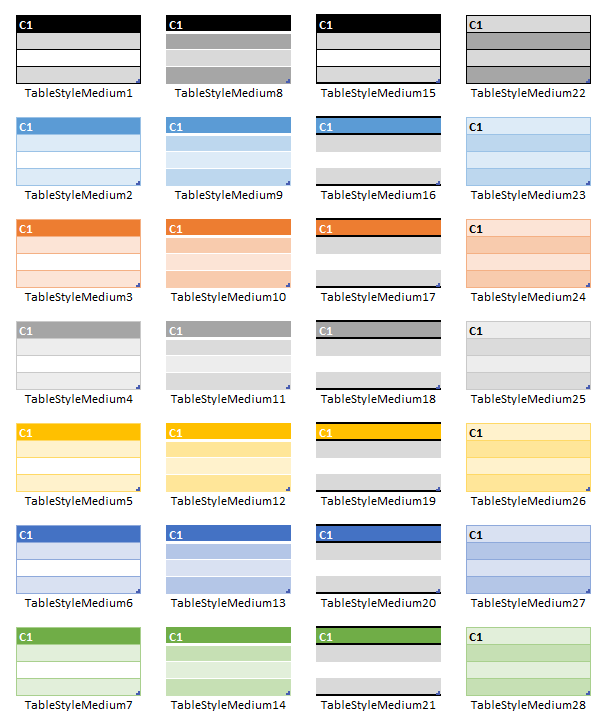
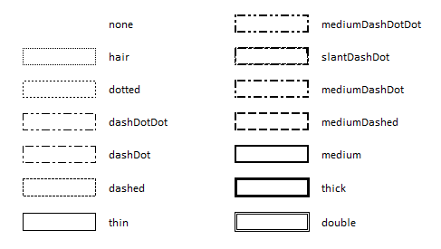
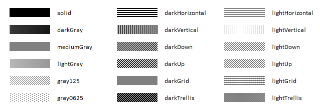

# ExcelGen - An Oracle PL/SQL Generator for MS Excel Files
<p align="center"></p>

ExcelGen is a PL/SQL utility to create Excel files (.xlsx, .xlsb) out of SQL data sources (query strings or cursors), with automatic pagination over multiple sheets.  
It supports encryption, cell merging, various formatting options through a built-in API or CSS, and table layout.

## Content
* [What's New in...](#whats-new-in)  
* [Bug tracker](#bug-tracker)  
* [Installation](#installation)  
* [Quick Start](#quick-start)  
* [ExcelGen Subprograms and Usage](#excelgen-subprograms-and-usage)  
* [Style specifications](#style-specifications)  
* [Examples](#examples-1)  
* [CHANGELOG](#changelog)  

## What's New in...

> Version 3.0 : cell API, CSS styling support, multitable sheet, merged cells
> Version 2.0 : support for XLSB format output  
> Version 1.0 : added encryption features  
> Version 0.1b : Beta version

## Bug tracker

Found a bug, have a question, or an enhancement request?  
Please create an issue [here](https://github.com/mbleron/ExcelGen/issues).

## Installation

### Getting source code

Clone this repository or download it as a zip archive.  

Note : [ExcelCommons](https://github.com/mbleron/ExcelCommons) and [MSUtilities](https://github.com/mbleron/MSUtilities) dependencies are provided as submodules, so use the clone command with recurse-submodules option :  
`git clone --recurse-submodules https://github.com/mbleron/ExcelGen.git`  
or download them separately as zip archives and extract the content of root folders into ExcelCommons and MSUtilities folders respectively.   

### Database requirement

ExcelGen requires Oracle Database 11\.2\.0\.1 and onwards.

### PL/SQL

Using SQL*Plus, connect to the target database schema, then :  
1. Install ExcelGen and dependencies using script [`install.sql`](./install.sql).  
2. If your schema does not have a grant to DBMS_CRYPTO, you can use script [`install_nocrypto.sql`](./install_nocrypto.sql), but will not be able to call the *setEncryption* procedure.

## Quick Start

Basic Excel export from a SQL query :  
```
declare
  ctxId   ExcelGen.ctxHandle;
  sheet1  ExcelGen.sheetHandle;
begin
  ctxId := ExcelGen.createContext();  
  sheet1 := ExcelGen.addSheetFromQuery(ctxId, 'sheet1', 'select * from my_table');
  ExcelGen.setHeader(ctxId, sheet1, p_frozen => true);
  ExcelGen.createFile(ctxId, 'TEST_DIR', 'my_file.xlsx');
  ExcelGen.closeContext(ctxId);
end;
/
```

See the following sections for more examples and detailed description of ExcelGen features.

## Operational Notes

### ExcelGen Model
<p align="center"></p>
The workbook structure is maintained in a context object referenced through its handle during the generation process.  

A workbook contains at least one sheet, and a stylesheet.  
A sheet may contain:  
* zero or more tables
* individual cells

A table is a contiguous rectangular set of cells (range) arranged in rows and columns, with an optional header row, and whose data comes from a SQL source (cursor or query string).

Provided there is only one table declared in a sheet, it is possible to partition the underlying data source across multiple sheets past the first one.  
Similarly, a sheet containing a single table will benefit from a streaming generation model, resulting in a low memory footprint. Otherwise, if the sheet contains multiple tables, or a mix of tables and individual cells, all data will first be built up in memory, then written out to the sheet.

Various styling options are available at sheet, table or cell level, using the built-in API or CSS.
Cell styles are defined globally in the context so that they can be referenced multiple times.

For simple requirements such as a single-table sheet, shortcut procedures and functions [addSheetFromQuery](#addsheetfromquery-procedure-and-function), [addSheetFromCursor](#addsheetfromcursor-procedure-and-function) and related table-agnostic subprograms are available to bypass table management.

## ExcelGen Subprograms and Usage
* Context and file management  
  * [createContext](#createcontext-function)  
  * [closeContext](#closecontext-procedure)  
  * [getFileContent](#getfilecontent-function)  
  * [createFile](#createfile-procedure)  
  * [setEncryption](#setencryption-procedure)  
* Sheet management  
  * [addSheet](#addsheet-function)
  * [addSheetFromQuery](#addsheetfromquery-procedure-and-function)  
  * [addSheetFromCursor](#addsheetfromcursor-procedure-and-function)  
  * [setSheetProperties](#setsheetproperties-procedure)  
  * [setHeader](#setheader-procedure)  
  * [setTableFormat](#settableformat-procedure)  
  * [setColumnProperties](#setcolumnproperties-procedure)  
  * [setColumnFormat](#setcolumnformat-procedure)  
  * [setRowProperties](#setrowproperties-procedure)
* Table management
  * [addTable](#addtable-function)
  * [setBindVariable](#setbindvariable-procedure)  
  * [setTableHeader](#settableheader-procedure)
  * [setTableProperties](#settableproperties-procedure)
  * [setTableColumnProperties](#settablecolumnproperties-procedure)
  * [setTableRowProperties](#settablerowproperties-procedure)
* Cell management
  * [putCell](#putcell-procedure)
  * [putNumberCell](#putnumbercell-procedure)
  * [putStringCell](#putstringcell-procedure)
  * [putDateCell](#putdatecell-procedure)
  * [mergeCells](#mergecells-procedure)
  * [makeCellRef](#makecellref-function)
* Style management
  * [setDateFormat](#setdateformat-procedure)  
  * [setTimestampFormat](#settimestampformat-procedure)  
  * [setNumFormat](#setnumformat-procedure)  
  * [makeRgbColor](#makergbcolor-function)  
  * [makeBorderPr](#makeborderpr-function)  
  * [makeBorder](#makeborder-function)  
  * [makeFont](#makefont-function)  
  * [makePatternFill](#makepatternfill-function)  
  * [makeAlignment](#makealignment-function)  
  * [makeCellStyle](#makecellstyle-function)  
  * [makeCellStyleCss](#makecellstylecss-function)  
---

### createContext function
This function creates and returns a new generator handle.  

```sql
function createContext (
  p_type  in pls_integer default FILE_XLSX 
)
return ctxHandle;
```

Parameter|Description|Mandatory
---|---|---
`p_type`|Output file format. <br/>One of `FILE_XLSX`, `FILE_XLSB`. Default is `FILE_XLSX`.|No

---
### closeContext procedure
Releases a context handle previously opened by [createContext](#createcontext-function) function.

```sql
procedure closeContext (
  p_ctxId  in ctxHandle 
);
```

Parameter|Description|Mandatory
---|---|---
`p_ctxId`|Context handle.|Yes

---
### addSheet function
Adds a new empty sheet and returns a sheetHandle value to be used with related subprograms.  

```sql
function addSheet (
  p_ctxId       in ctxHandle
, p_sheetName   in varchar2
, p_tabColor    in varchar2 default null
, p_sheetIndex  in pls_integer default null
)
return sheetHandle;
```

Parameter|Description|Mandatory
---|---|---
`p_ctxId`|Context handle.|Yes
`p_sheetName`|Sheet name.|Yes
`p_tabColor`|Tab [color](#color-specification) of the new sheet.|No
`p_sheetIndex`|Sheet tab index in the workbook. <br/>If omitted, the sheet is added at the end of the list, after the last existing index.|No

**Notes :**  
The list of sheet indices specified via `p_sheetIndex` may be sparse.  
For example, if one adds sheet 'A' at index 2, sheet 'B' at index 4 and sheet 'C' at index 1, the resulting workbook will show sheets 'C', 'A' and 'B' in that order.

---
### addTable function
This function adds a new table to a given sheet, and returns a handle to be used in related subprograms.  
The table may be based on a SQL query string or a weakly-typed ref cursor.  

```sql
function addTable (
  p_ctxId            in ctxHandle
, p_sheetId          in sheetHandle
, p_query            in varchar2
, p_paginate         in boolean default false
, p_pageSize         in pls_integer default null
, p_anchorRowOffset  in pls_integer default null
, p_anchorColOffset  in pls_integer default null
, p_anchorTableId    in tableHandle default null
, p_anchorPosition   in pls_integer default null
)
return tableHandle;
```
```sql
function addTable (
  p_ctxId            in ctxHandle
, p_sheetId          in sheetHandle
, p_rc               in sys_refcursor
, p_paginate         in boolean default false
, p_pageSize         in pls_integer default null
, p_anchorRowOffset  in pls_integer default null
, p_anchorColOffset  in pls_integer default null
, p_anchorTableId    in tableHandle default null
, p_anchorPosition   in pls_integer default null
)
return tableHandle;
```

Parameter|Description|Mandatory
---|---|---
`p_ctxId`|Context handle.|Yes
`p_sheetId`|Sheet handle.|Yes
`p_query`|SQL query string. <br/>Bind variables (if any) can be set via [setBindVariable](#setbindvariable-procedure) procedure.|Yes
`p_rc`|Input ref cursor.|Yes
`p_paginate`|Enables pagination of the input data source over multiple sheets. <br/>Use `p_pageSize` parameter to control the maximum number of rows per sheet.|No
`p_pageSize`|Maximum number of rows per sheet, when pagination is enabled. <br/>If set to NULL, Excel sheet limit is used (1,048,576 rows).|No
`p_anchorRowOffset`|Row offset of the top-left cell of the table. <br/>If `p_anchorTableId` is not NULL, this offset is relative to the table position specified by `p_anchorPosition`, otherwise it is an absolute offset in the sheet.|No
`p_anchorColOffset`|Column offset of the top-left cell of the table. <br/>If `p_anchorTableId` is not NULL, this offset is relative to the table position specified by `p_anchorPosition`, otherwise it is an absolute offset in the sheet.|No
`p_anchorTableId`|Handle of the anchor table.|No
`p_anchorPosition`|Position in the anchor table from which row and column offsets are applied. <br>One of `TOP_LEFT`, `TOP_RIGHT`, `BOTTOM_RIGHT`, `BOTTOM_LEFT`.|No

**Notes :**  
Allowed SQL column data types are : 
`VARCHAR2`, `CHAR`, `NUMBER`, `DATE`, `TIMESTAMP`, `TIMESTAMP WITH TIME ZONE`, `CLOB`, or `ANYDATA`, which must encapsulate one of the former scalar types.

Pagination of the query results is only possible when this is the only table of the sheet.  

When pagination is enabled, three substitution variables may be used to generate unique names from the input sheet name pattern : 
* PNUM : current page number 
* PSTART : first row number of the current page
* PSTOP : last row number of the current page

For example :  
`sheet${PNUM}` will be expanded to `sheet1`, `sheet2`, `sheet3`, etc.  
`${PSTART}-${PSTOP}` will be expanded to `1-1000`, `1001-2000`, `2001-3000`, etc. assuming a page size of 1000 rows.  

Table positioning may be absolute in the owning sheet, or relative to another table.  
For the former method, row and column offsets correspond to row and column (1-based) indices respectively, and for the latter, offsets are 0-based from one the four anchor table corners:  

  

In this example, the absolute position (row, column) of Cell1 is (7, 5), while relative positions from Table1 corners are:  

TOP_LEFT: (4, 3)  
TOP_RIGHT: (4, 1)  
BOTTOM_RIGHT: (2, 1)  
BOTTOM_LEFT: (2, 3)  

---
### putCell procedure  
Adds or overwrites a cell identified by its row and column indices, in a given sheet. Cell addressing may be absolute or relative to a given table object previously defined.  

```sql
procedure putCell (
  p_ctxId           in ctxHandle
, p_sheetId         in sheetHandle
, p_rowIdx          in pls_integer
, p_colIdx          in pls_integer
, p_value           in anydata default null
, p_style           in cellStyleHandle default null 
, p_anchorTableId   in tableHandle default null
, p_anchorPosition  in pls_integer default null
);
```

Parameter|Description|Mandatory
---|---|---
`p_ctxId`|Context handle.|Yes
`p_sheetId`|Sheet handle.|Yes
`p_rowIdx`|1-based row index of the cell, if `p_anchorTableId` is NULL. Otherwise represents a 0-based row offset from the table anchor position.|Yes
`p_colIdx`|1-based column index of the cell, if `p_anchorTableId` is NULL. Otherwise represents a 0-based column offset from the table anchor position.|Yes
`p_value`|Cell value, provided as an ANYDATA instance. <br/>Supported encapsulated types are: NUMBER, VARCHAR2, DATE, TIMESTAMP, TIMESTAMP WITH TIME ZONE and CLOB.|No
`p_style`|Handle to a cell style created via [makeCellStyle](#makecellstyle-function) or [makeCellStyleCss](#makecellstylecss-function) function.|No
`p_anchorTableId`|Handle of the anchor table.|No
`p_anchorPosition`|Position in the anchor table from which row and column offsets are applied. <br>One of `TOP_LEFT`, `TOP_RIGHT`, `BOTTOM_RIGHT`, `BOTTOM_LEFT`.|No

Three convenience procedures are also provided to directly put a numeric, string or date value: [putNumberCell](#putnumbercell-function), [putStringCell](#putstringcell-function) and [putDateCell](#putdatecell-function).

---
### putNumberCell procedure  
Sets a numeric value in a given cell.
See [putCell](#putcell-function) function for a description of common parameters.
```sql
procedure putCell (
  p_ctxId           in ctxHandle
, p_sheetId         in sheetHandle
, p_rowIdx          in pls_integer
, p_colIdx          in pls_integer
, p_value           in number
, p_style           in cellStyleHandle default null 
, p_anchorTableId   in tableHandle default null
, p_anchorPosition  in pls_integer default null
);
```

---
### putStringCell procedure  
Sets a string value in a given cell.
See [putCell](#putcell-function) function for a description of common parameters.
```sql
procedure putCell (
  p_ctxId           in ctxHandle
, p_sheetId         in sheetHandle
, p_rowIdx          in pls_integer
, p_colIdx          in pls_integer
, p_value           in varchar2
, p_style           in cellStyleHandle default null 
, p_anchorTableId   in tableHandle default null
, p_anchorPosition  in pls_integer default null
);
```

---
### putDateCell procedure  
Sets a date value in a given cell.
See [putCell](#putcell-function) function for a description of common parameters.
```sql
procedure putCell (
  p_ctxId           in ctxHandle
, p_sheetId         in sheetHandle
, p_rowIdx          in pls_integer
, p_colIdx          in pls_integer
, p_value           in date
, p_style           in cellStyleHandle default null 
, p_anchorTableId   in tableHandle default null
, p_anchorPosition  in pls_integer default null
);
```

---
### addSheetFromQuery procedure and function
Adds a new sheet based on a SQL query string, with optional pagination.  
Available both as a procedure and a function.  
The function returns a sheetHandle value to be used with related subprograms.    

```sql
procedure addSheetFromQuery (
  p_ctxId       in ctxHandle
, p_sheetName   in varchar2
, p_query       in varchar2
, p_tabColor    in varchar2 default null
, p_paginate    in boolean default false
, p_pageSize    in pls_integer default null
, p_sheetIndex  in pls_integer default null
);
```
```sql
function addSheetFromQuery (
  p_ctxId       in ctxHandle
, p_sheetName   in varchar2
, p_query       in varchar2
, p_tabColor    in varchar2 default null
, p_paginate    in boolean default false
, p_pageSize    in pls_integer default null
, p_sheetIndex  in pls_integer default null
)
return sheetHandle;
```

Parameter|Description|Mandatory
---|---|---
`p_ctxId`|Cf. [addSheet](#addsheet-function).|Yes
`p_sheetName`|Cf. [addSheet](#addsheet-function).|Yes
`p_query`|Cf. [addTable](#addtable-function).|Yes
`p_tabColor`|Cf. [addSheet](#addsheet-function).|No
`p_paginate`|Cf. [addTable](#addtable-function).|No
`p_pageSize`|Cf. [addTable](#addtable-function).|No
`p_sheetIndex`|Cf. [addSheet](#addsheet-function).|No

---
### addSheetFromCursor procedure and function
Adds a new sheet based on a weakly-typed ref cursor, with optional pagination.  
Available both as a procedure and a function.  
The function returns a sheetHandle value to be used with related subprograms.  

```sql
procedure addSheetFromCursor (
  p_ctxId       in ctxHandle
, p_sheetName   in varchar2
, p_rc          in sys_refcursor
, p_tabColor    in varchar2 default null
, p_paginate    in boolean default false
, p_pageSize    in pls_integer default null
, p_sheetIndex  in pls_integer default null
);
```
```sql
function addSheetFromCursor (
  p_ctxId       in ctxHandle
, p_sheetName   in varchar2
, p_rc          in sys_refcursor
, p_tabColor    in varchar2 default null
, p_paginate    in boolean default false
, p_pageSize    in pls_integer default null
, p_sheetIndex  in pls_integer default null
)
return sheetHandle;
```

Parameter|Description|Mandatory
---|---|---
`p_ctxId`|Cf. [addSheet](#addsheet-function).|Yes
`p_sheetName`|Cf. [addSheet](#addsheet-function).|Yes
`p_rc`|Cf. [addTable](#addtable-function).|Yes
`p_tabColor`|Cf. [addSheet](#addsheet-function).|No
`p_paginate`|Cf. [addTable](#addtable-function).|No
`p_pageSize`|Cf. [addTable](#addtable-function).|No
`p_sheetIndex`|Cf. [addSheet](#addsheet-function).|No

---
### setBindVariable procedure
This procedure binds a value to a variable from the SQL query associated with a table.  
It is overloaded in two ways:  
* By variable data type: NUMBER, VARCHAR2 or DATE
* By referencing either a table, or only a sheet handle. In the latter case, the first table of the sheet will be used.  

**Legacy overloads expecting a sheet name are deprecated and will be removed in a future version.**

```sql
procedure setBindVariable (
  p_ctxId      in ctxHandle
, p_sheetId    in sheetHandle
, p_tableId    in tableHandle
, p_bindName   in varchar2
, p_bindValue  in number
);
```
```sql
procedure setBindVariable (
  p_ctxId      in ctxHandle
, p_sheetId    in sheetHandle
, p_tableId    in tableHandle
, p_bindName   in varchar2
, p_bindValue  in varchar2
);
```
```sql
procedure setBindVariable (
  p_ctxId      in ctxHandle
, p_sheetId    in sheetHandle
, p_tableId    in tableHandle
, p_bindName   in varchar2
, p_bindValue  in date
);
```
```sql
procedure setBindVariable (
  p_ctxId       in ctxHandle
, p_sheetId     in sheetHandle
, p_bindName    in varchar2
, p_bindValue   in number
);
```
```sql
procedure setBindVariable (
  p_ctxId      in ctxHandle
, p_sheetId    in sheetHandle
, p_bindName   in varchar2
, p_bindValue  in varchar2
);
```
```sql
procedure setBindVariable (
  p_ctxId      in ctxHandle
, p_sheetId    in sheetHandle
, p_bindName   in varchar2
, p_bindValue  in date
);
```
*Deprecated:*
```sql
procedure setBindVariable (
  p_ctxId      in ctxHandle
, p_sheetName  in varchar2
, p_bindName   in varchar2
, p_bindValue  in number
);
```
```sql
procedure setBindVariable (
  p_ctxId      in ctxHandle
, p_sheetName  in varchar2
, p_bindName   in varchar2
, p_bindValue  in varchar2
);
```
```sql
procedure setBindVariable (
  p_ctxId      in ctxHandle
, p_sheetName  in varchar2
, p_bindName   in varchar2
, p_bindValue  in date
);
```

Parameter|Description|Mandatory
---|---|---
`p_ctxId`|Context handle.|Yes
`p_sheetName`|Sheet name.|Yes
`p_sheetId`|Sheet handle.|Yes
`p_tableId`|Table handle.|Yes
`p_bindName`|Bind variable name.|Yes
`p_bindValue`|Bind variable value.|Yes

---  
### setHeader procedure
This procedure adds a header row to the first table of a given sheet. It should be used only when the sheet contains a single table.  
By default, column names are derived from the SQL source query, but they can be customized individually using [setColumnFormat](#setcolumnformat-procedure) procedure.  

```sql
procedure setHeader (
  p_ctxId       in ctxHandle
, p_sheetName   in varchar2
, p_style       in cellStyleHandle default null
, p_frozen      in boolean default false
, p_autoFilter  in boolean default false
);
```
```sql
procedure setHeader (
  p_ctxId       in ctxHandle
, p_sheetId     in sheetHandle
, p_style       in cellStyleHandle default null
, p_frozen      in boolean default false
, p_autoFilter  in boolean default false
);
```

Parameter|Description|Mandatory
---|---|---
`p_ctxId`|Context handle.|Yes
`p_sheetName`|Sheet name.|Yes
`p_sheetId`|Sheet handle.|Yes
`p_style`|Handle to a cell style created via [makeCellStyle](#makecellstyle-function) or [makeCellStyleCss](#makecellstylecss-function) function.|No
`p_frozen`|Set this parameter to true in order to freeze the header row.|No
`p_autoFilter`|Set this parameter to true in order to add an automatic filter to this sheet.|No

---
### setTableFormat procedure
This procedure applies a table layout to the first table of a given sheet. It should be used only when the sheet contains a single table.  
```sql
procedure setTableFormat (
  p_ctxId      in ctxHandle
, p_sheetId    in sheetHandle
, p_style      in varchar2 default null
);
```
*Deprecated:*
```sql
procedure setTableFormat (
  p_ctxId      in ctxHandle
, p_sheetName  in varchar2
, p_style      in varchar2 default null
);
```

Parameter|Description|Mandatory
---|---|---
`p_ctxId`|Context handle.|Yes
`p_sheetName`|Sheet name.|Yes
`p_sheetId`|Sheet handle.|Yes
`p_styleName`|Name of a predefined Excel table style to apply. <br/>See [Predefined table styles](#predefined-table-styles) for a list of available styles.|No

---
### setSheetProperties procedure
Sets sheet-level properties.

```sql
procedure setSheetProperties (
  p_ctxId                in ctxHandle
, p_sheetId              in sheetHandle
, p_activePaneAnchorRef  in varchar2 default null
, p_showGridLines        in boolean default true
, p_showRowColHeaders    in boolean default true
, p_defaultRowHeight     in number default null
);
```

Parameter|Description|Mandatory
---|---|---
`p_ctxId`|Context handle.|Yes
`p_sheetId`|Sheet handle.|Yes
`p_activePaneAnchorRef`|For frozen panes, reference of the top-left cell of the bottom-right pane. <br/>For example, passing 'A2' will freeze the first row of the sheet.|No
`p_showGridLines`|Hide or show grid lines on the sheet. Default is `true` (show).|No
`p_showRowColHeaders`|Hide or show row and column headers on the sheet. Default is `true` (show).|No
`p_defaultRowHeight`|Default row height on this sheet, in points.|No

---
### setTableProperties procedure
Sets table-level properties.

```sql
procedure setTableProperties (
  p_ctxId              in ctxHandle
, p_sheetId            in sheetHandle
, p_tableId            in tableHandle
, p_style              in varchar2 default null
, p_showFirstColumn    in boolean default false
, p_showLastColumn     in boolean default false
, p_showRowStripes     in boolean default true
, p_showColumnStripes  in boolean default false
);
```

Parameter|Description|Mandatory
---|---|---
`p_ctxId`|Context handle.|Yes
`p_sheetId`|Sheet handle.|Yes
`p_tableId`|Table handle.|Yes
`p_style`|Name of a predefined Excel table style to apply. <br/>See [Predefined table styles](#predefined-table-styles) for a list of available styles.|No
`p_showFirstColumn`|Highlight first column of the table. Default is `false`.|No
`p_showLastColumn`|Highlight last column of the table. Default is `false`.|No
`p_showRowStripes`|Hide or show row stripes. Default is `true` (show).|No
`p_showColumnStripes`|Hide or show column stripes. Default is `false` (hide).|No

---
### setTableHeader procedure
This procedure adds a header row to a given table, with optional cell style and auto-filtering.  
By default, column names are derived from the SQL source query, but they can be customized individually using [setTableColumnProperties](#settablecolumnproperties-procedure) procedure.  

```sql
procedure setTableHeader (
  p_ctxId       in ctxHandle
, p_sheetId     in sheetHandle
, p_tableId     in tableHandle
, p_style       in cellStyleHandle default null
, p_autoFilter  in boolean default false
);
```

Parameter|Description|Mandatory
---|---|---
`p_ctxId`|Context handle.|Yes
`p_sheetId`|Sheet handle.|Yes
`p_tableId`|Table handle.|Yes
`p_style`|Cell style handle created via [makeCellStyle](#makecellstyle-function) or [makeCellStyleCss](#makecellstylecss-function) function.|No
`p_autoFilter`|If set to `true`, adds an automatic filter to each column.|No

---
### setTableColumnProperties procedure
This procedure sets table-level column properties: column name and cell style.
If a table header is displayed, a column name set this way overrides the SQL name from the source query.  

```sql
procedure setTableColumnProperties (
  p_ctxId       in ctxHandle
, p_sheetId     in sheetHandle
, p_tableId     in pls_integer
, p_columnId    in pls_integer
, p_columnName  in varchar2 default null
, p_style       in cellStyleHandle default null
);
```

Parameter|Description|Mandatory
---|---|---
`p_ctxId`|Context handle.|Yes
`p_sheetId`|Sheet handle.|Yes
`p_tableId`|Table handle.|Yes
`p_columnId`|Column index.|Yes
`p_columnName`|Column name.|No
`p_style`|Cell style handle created via [makeCellStyle](#makecellstyle-function) or [makeCellStyleCss](#makecellstylecss-function) function.|No

---
### setTableRowProperties procedure
This procedure sets table-level row properties: cell style.  

```sql
procedure setTableRowProperties (
  p_ctxId    in ctxHandle
, p_sheetId  in sheetHandle
, p_tableId  in pls_integer
, p_rowId    in pls_integer
, p_style    in cellStyleHandle
);
```

Parameter|Description|Mandatory
---|---|---
`p_ctxId`|Context handle.|Yes
`p_sheetId`|Sheet handle.|Yes
`p_tableId`|Table handle.|Yes
`p_rowId`|Local row index, relative to the beginning of the table.|Yes
`p_style`|Cell style handle created via [makeCellStyle](#makecellstyle-function) or [makeCellStyleCss](#makecellstylecss-function) function.|Yes

---
### setDateFormat procedure
This procedure sets the format applied to DATE values in the resulting spreadsheet file.  
It is overloaded to operate either globally in the workbook or at a given sheet level, which takes precedence.  

The format must follow MS Excel proprietary [syntax](https://support.office.com/en-us/article/format-a-date-the-way-you-want-8e10019e-d5d8-47a1-ba95-db95123d273e).  
Default is `dd/mm/yyyy hh:mm:ss`.  

```sql
procedure setDateFormat (
  p_ctxId   in ctxHandle
, p_format  in varchar2
);
```
```sql
procedure setDateFormat (
  p_ctxId   in ctxHandle
, p_sheetId in sheetHandle
, p_format  in varchar2
);
```

Parameter|Description|Mandatory
---|---|---
`p_ctxId`|Context handle.|Yes
`p_sheetId`|Sheet handle.|Yes
`p_format`|Date format string.|Yes

---
### setTimestampFormat procedure
This procedure sets the format applied to TIMESTAMP values in the resulting spreadsheet file.  
It is overloaded to operate either globally in the workbook or at a given sheet level, which takes precedence.  

Default is `dd/mm/yyyy hh:mm:ss.000`.  

```sql
procedure setTimestampFormat (
  p_ctxId   in ctxHandle
, p_format  in varchar2
);
```
```sql
procedure setTimestampFormat (
  p_ctxId   in ctxHandle
, p_sheetId in sheetHandle
, p_format  in varchar2
);
```

Parameter|Description|Mandatory
---|---|---
`p_ctxId`|Context handle.|Yes
`p_sheetId`|Sheet handle.|Yes
`p_format`|Timestamp format string.|Yes

---
### setNumFormat procedure
This procedure sets the format applied to NUMBER values in the resulting spreadsheet file.  
It is overloaded to operate either globally in the workbook or at a given sheet level, which takes precedence.  

The format must follow MS Excel proprietary [syntax](https://support.microsoft.com/en-us/office/create-a-custom-number-format-78f2a361-936b-4c03-8772-09fab54be7f4).  
Default is NULL, meaning the General cell format will apply.  

```sql
procedure setNumFormat (
  p_ctxId   in ctxHandle
, p_format  in varchar2
);
```
```sql
procedure setNumFormat (
  p_ctxId   in ctxHandle
, p_sheetId in sheetHandle
, p_format  in varchar2
);
```

Parameter|Description|Mandatory
---|---|---
`p_ctxId`|Context handle.|Yes
`p_sheetId`|Sheet handle.|Yes
`p_format`|Number format string.|Yes

---
### setRowProperties procedure
This procedure sets custom sheet-level row properties for :  style, row height.  

```sql
procedure setRowProperties (
  p_ctxId    in ctxHandle
, p_sheetId  in sheetHandle
, p_rowId    in pls_integer
, p_style    in cellStyleHandle default null
, p_height   in number default null
);
```

Parameter|Description|Mandatory
---|---|---
`p_ctxId`|Context handle.|Yes
`p_sheetId`|Sheet handle.|Yes
`p_rowId`|Row index.|Yes
`p_style`|Cell style handle created via [makeCellStyle](#makecellstyle-function) or [makeCellStyleCss](#makecellstylecss-function) function.|No
`p_height`|Row height in points.|No

---
### setColumnProperties procedure
This procedure sets custom sheet-level column properties for :  style, column header, column width.  

The column header parameter is used to set a custom column name when the sheet is composed of a single table. If there's more than one table defined, it applies to the first table found.  

```sql
procedure setColumnProperties (
  p_ctxId     in ctxHandle
, p_sheetId   in sheetHandle
, p_columnId  in pls_integer
, p_style     in cellStyleHandle default null
, p_header    in varchar2 default null
, p_width     in number default null
);
```

Parameter|Description|Mandatory
---|---|---
`p_ctxId`|Context handle.|Yes
`p_sheetId`|Sheet handle.|Yes
`p_columnId`|Column id (1-based index).|Yes
`p_style`|Handle to a cell style created via [makeCellStyle](#makecellstyle-function) or [makeCellStyleCss](#makecellstylecss-function) function.|No
`p_header`|Column header. Takes precedence over the column name from the source SQL query when the sheet is composed of a single table.|No
`p_width`|Column width. <br/>From [ECMA-376 Standard Part 1](https://www.ecma-international.org/publications-and-standards/standards/ecma-376/) (§ 18.3.1.13): _measured as the number of characters of the maximum digit width of the numbers 0, 1, 2, …, 9 as rendered in the normal style's font_ (currently "Calibri 11pt").|No

---
### setColumnFormat procedure
This procedure sets custom column-level properties:  number/date format, column header, column width.  

It provides the same functionalities as [setColumnProperties](#setcolumnproperties-procedure) except that it only sets the number/date format part of the cell style.  

```sql
procedure setColumnFormat (
  p_ctxId     in ctxHandle
, p_sheetId   in sheetHandle
, p_columnId  in pls_integer
, p_format    in varchar2 default null
, p_header    in varchar2 default null
, p_width     in number default null
);
```

Parameter|Description|Mandatory
---|---|---
`p_ctxId`|Cf. [setColumnProperties](#setcolumnproperties-procedure).|Yes
`p_sheetId`|Cf. [setColumnProperties](#setcolumnproperties-procedure).|Yes
`p_columnId`|Cf. [setColumnProperties](#setcolumnproperties-procedure).|Yes
`p_format`|Format string. <br/>It takes precedence over existing workbook or sheet-level settings for NUMBER, DATE or TIMESTAMP data types. <br/>The format must follow MS Excel proprietary [syntax](https://support.microsoft.com/en-us/office/create-a-custom-number-format-78f2a361-936b-4c03-8772-09fab54be7f4).  |No
`p_header`|Cf. [setColumnProperties](#setcolumnproperties-procedure).|No
`p_width`|Cf. [setColumnProperties](#setcolumnproperties-procedure).|No

---
### mergeCells procedure
This procedure declares a range of cells to be merged in the resulting sheet.  
The range may be defined by a string expression (overload 1), or by its position and span across rows and columns (overload 2). The latter allows relative positioning from a previously defined table object.

```sql
procedure mergeCells (
  p_ctxId    in ctxHandle
, p_sheetId  in sheetHandle
, p_range    in varchar2
);
```
```sql
procedure mergeCells (
  p_ctxId           in ctxHandle
, p_sheetId         in sheetHandle
, p_rowOffset       in pls_integer
, p_colOffset       in pls_integer
, p_rowSpan         in pls_integer
, p_colSpan         in pls_integer
, p_anchorTableId   in tableHandle default null
, p_anchorPosition  in pls_integer default null
);
```

Parameter|Description|Mandatory
---|---|---
`p_ctxId`|Context handle.|Yes
`p_sheetId`|Sheet handle.|Yes
`p_range`|Range of cells to merge. <br/>For example: `'C2:E5'`.|Yes
`p_rowOffset`|1-based row index of the top-left cell of the range, if `p_anchorTableId` is NULL. Otherwise represents a 0-based row offset from the table anchor position.|Yes
`p_colOffset`|1-based column index of the top-left cell of the range, if `p_anchorTableId` is NULL. Otherwise represents a 0-based column offset from the table anchor position.|Yes
`p_rowSpan`|Number of rows this range spans.|Yes
`p_colSpan`|Number of columns this range spans.|Yes
`p_anchorTableId`|Handle of the anchor table.|No
`p_anchorPosition`|Position in the anchor table from which row and column offsets are applied. <br>One of `TOP_LEFT`, `TOP_RIGHT`, `BOTTOM_RIGHT`, `BOTTOM_LEFT`.|No

---
### makeCellRef function
This function creates a cell reference string from given column and row indices (1-based).  
For example, `makeCellRef(54,8)` will return `'BB8'`.

```sql
function makeCellRef (
  p_colIdx  in pls_integer
, p_rowIdx  in pls_integer
)
return varchar2;
```

Parameter|Description|Mandatory
---|---|---
`p_colIdx`|Column index.|Yes
`p_rowIdx`|Row index.|Yes

---
### setEncryption procedure
This procedure sets the password used to encrypt the document, along with the minimum compatible Office version necessary to open it.

```sql
procedure setEncryption (
  p_ctxId       in ctxHandle
, p_password    in varchar2
, p_compatible  in pls_integer default OFFICE2007SP2
);
```

Parameter|Description|Mandatory
---|---|---
`p_ctxId`|Context handle.|Yes
`p_password`|Password.|Yes
`p_compatible`|Minimum compatible Office version for encryption. <br/>One of `OFFICE2007SP1`, `OFFICE2007SP2`, `OFFICE2010`, `OFFICE2013`, `OFFICE2016`. Default is `OFFICE2007SP2`.|No


---
### getFileContent function
This function builds the spreadsheet file and returns it as a temporary BLOB.  

```sql
function getFileContent (
  p_ctxId  in ctxHandle
)
return blob; 
```

---
### createFile procedure
This procedure builds the spreadsheet file and write it directly to a directory.  

```sql
procedure createFile (
  p_ctxId      in ctxHandle
, p_directory  in varchar2
, p_filename   in varchar2
);
```

Parameter|Description|Mandatory
---|---|---
`p_ctxId`|Context handle.|Yes
`p_directory`|Target directory.<br/> Must be a valid Oracle directory name.|Yes
`p_filename`|File name.|Yes

---
### STYLING

### makeRgbColor function
This function builds an RGBA color value in hexadecimal notation from individual Red, Green and Blue components supplied as unsigned 8-bit integers (0-255), and optional Alpha component as a floating-point number between 0 and 1.
For example:  
`makeRgbColor(219,112,147)` will return `#DB7093`.  
`makeRgbColor(0,255,0,.2)` will return `#00FF0033`.  

```sql
function makeRgbColor (
  r  in uint8
, g  in uint8
, b  in uint8
, a  in number default null
)
return varchar2;
```

Parameter|Description|Mandatory
---|---|---
`r`|Red component value.|Yes
`g`|Green component value.|Yes
`b`|Blue component value.|Yes
`a`|Alpha component value. <br/>See [Color specification](#color-specification) for details on how ExcelGen interprets this value.|No

---
### makeBorderPr function
This function builds an instance of a cell border edge, from a border style name and a color.

```sql
function makeBorderPr (
  p_style  in varchar2 default null
, p_color  in varchar2 default null
)
return CT_BorderPr;
```

Parameter|Description|Mandatory
---|---|---
`p_style`|Border style name. <br/>See [Border styles](#border-styles) for a list of available styles.|No
`p_color`|Border [color](#color-specification).|No

---
### makeBorder function
This function builds an instance of a cell border (all edges).  
It is overloaded to accept either individual edge formatting (left, right, top and bottom), or the same format for all edges.

Overload 1 :  
```sql
function makeBorder (
  p_left    in CT_BorderPr default makeBorderPr()
, p_right   in CT_BorderPr default makeBorderPr()
, p_top     in CT_BorderPr default makeBorderPr()
, p_bottom  in CT_BorderPr default makeBorderPr()
)
return CT_Border;
```

Overload 2 :  
```sql
function makeBorder (
  p_style  in varchar2
, p_color  in varchar2 default null
)
return CT_Border;
```

Overload 2 is a shorthand for : 
```
makeBorder(
  p_left    => makeBorderPr(p_style, p_color)
, p_right   => makeBorderPr(p_style, p_color)
, p_top     => makeBorderPr(p_style, p_color)
, p_bottom  => makeBorderPr(p_style, p_color)
)
```

Parameter|Description|Mandatory
---|---|---
`p_left`|Left edge format, as returned by [makeBorderPr](#makeborderpr-function) function.|No
`p_right`|Right edge format, as returned by [makeBorderPr](#makeborderpr-function) function.|No
`p_top`|Top edge format, as returned by [makeBorderPr](#makeborderpr-function) function.|No
`p_bottom`|Bottom edge format, as returned by [makeBorderPr](#makeborderpr-function) function.|No
`p_style`|Border style name.|Yes
`p_color`|Border [color](#color-specification).|No

---
### makeFont function
This function builds an instance of a cell font.

```sql
function makeFont (
  p_name   in varchar2
, p_sz     in pls_integer
, p_b      in boolean default false
, p_i      in boolean default false
, p_color  in varchar2 default null
, p_u      in varchar2 default null
)
return CT_Font;
```

Parameter|Description|Mandatory
---|---|---
`p_name`|Font name.|Yes
`p_sz`|Font size, in points.|Yes
`p_b`|Bold font style (true\|false).|No
`p_i`|Italic font style (true\|false).|No
`p_color`|Font [color](#color-specification).|No
`p_u`|Underline style. <br/>One of `none`, `single`, `double`, `singleAccounting`, `doubleAccounting`. Default is `none`.|No

---
### makePatternFill function
This function builds an instance of a cell pattern fill.

```sql
function makePatternFill (
  p_patternType  in varchar2
, p_fgColor      in varchar2 default null
, p_bgColor      in varchar2 default null
)
return CT_Fill;
```

Parameter|Description|Mandatory
---|---|---
`p_patternType`|Pattern type. <br/>See [Pattern types](#pattern-types) for a list of available types.|Yes
`p_fgColor`|Foreground [color](#color-specification) of the pattern.|No
`p_bgColor`|Background [color](#color-specification) of the pattern.|No

Note :
For a solid fill (no pattern), the color must be specified using the foreground color parameter.  

---
### makeAlignment function
This function builds an instance of a cell alignment.

```sql
function makeAlignment (
  p_horizontal  in varchar2 default null
, p_vertical    in varchar2 default null
, p_wrapText    in boolean default false
)
return CT_CellAlignment;
```

Parameter|Description|Mandatory
---|---|---
`p_horizontal`|Horizontal alignment type, one of `left`, `center` or `right`.|No
`p_vertical`|Vertical alignment type, one of `top`, `center` or `bottom`.|No
`p_wrapText`|Cell text wrapping. Default is `false`.|No

---
### makeCellStyle function
This function builds an instance of a cell style, composed of optional number format, font, fill and border specifications, and returns a handle to it.

```sql
function makeCellStyle (
  p_ctxId       in ctxHandle
, p_numFmtCode  in varchar2 default null
, p_font        in CT_Font default null
, p_fill        in CT_Fill default null
, p_border      in CT_Border default null
, p_alignment   in CT_CellAlignment default null
)
return cellStyleHandle;
```

Parameter|Description|Mandatory
---|---|---
`p_ctxId`|Context handle.|Yes
`p_numFmtCode`|Number format code.|No
`p_font`|Font style instance, as returned by [makeFont](#makefont-function) function.|No
`p_fill`|Fill style instance, as returned by [makePatternFill](#makepatternfill-function) function.|No
`p_border`|Border style instance, as returned by [makeBorder](#makeborder-function) function.|No
`p_alignment`|Cell alignment instance, as returned by [makeAlignment](#makealignment-function) function.|No

Example:  

This sample code creates a cell style composed of the following facets : 
* Font : Calibri, 11 pts, bold face
* Fill : YellowGreen solid fill
* Border : Thick red edges
* Alignment : Horizontally centered
```sql
declare

  ctxId      ExcelGen.ctxHandle;
  cellStyle  ExcelGen.cellStyleHandle;

begin
  ...
 
  cellStyle := ExcelGen.makeCellStyle(
                 p_ctxId     => ctxId
               , p_font      => ExcelGen.makeFont('Calibri',11,true)
               , p_fill      => ExcelGen.makePatternFill('solid','YellowGreen')
               , p_border    => ExcelGen.makeBorder('thick','red')
               , p_alignment => ExcelGen.makeAlignment(horizontal => 'center')
               );
  ...
```

---
### makeCellStyleCss function
This function builds an instance of a cell style, from a CSS style string, and returns a handle to it.  
See [Style specifications/CSS](#css) for all supported features.

```sql
function makeCellStyleCss (
  p_ctxId  in ctxHandle
, p_css    in varchar2
)
return cellStyleHandle;
```

Parameter|Description|Mandatory
---|---|---
`p_ctxId`|Context handle.|Yes
`p_css`|CSS string.|Yes

Example:  

```sql
declare

  ctxId      ExcelGen.ctxHandle;
  cellStyle  ExcelGen.cellStyleHandle;
  
begin
  ...
 
  cellStyle := ExcelGen.makeCellStyleCss(
                 p_ctxId => ctxId
               , p_css   => 'font:bold 11pt Calibri;
                             background:YellowGreen;
                             border:thick solid red;
                             text-align:center'
               );
  ...
```

## Style specifications

### CSS
As of ExcelGen 3, it is possible to declare cell styles using CSS syntax, in addition to the built-in styling API.
Standard CSS properties and values relevant for cell styling are supported, e.g. `border`, `font`, `background`, `color` etc. along with MS Office extensions.  

#### Examples
  
CSS declaration:  
```css
font:14pt "Arial Black";
color:red;
border:double #5B9BD5;
text-align:center;
vertical-align:middle;
```
Equivalent Style API declaration via [makeCellStyle](#makecellstyle-function) : 
```sql
p_font => ExcelGen.makeFont(p_name => 'Arial Black', p_sz => 14, p_color => 'red'), 
p_border => ExcelGen.makeBorder(p_style => 'double', p_color => '#5B9BD5'), 
p_alignment => ExcelGen.makeAlignment(p_horizontal => 'center', p_vertical => 'center')
```


  
CSS declaration:  
```css
font-style:italic;text-decoration:underline;background:orange
```
Equivalent Style API declaration via [makeCellStyle](#makecellstyle-function) : 
```sql
p_font => ExcelGen.makeFont(p_i => true, p_u => 'single'), 
p_fill => ExcelGen.makePatternFill('solid', 'orange')
```


  
CSS declaration:  
```css
font-weight:bold;border-top:medium dashed;border-bottom:medium dashed;vertical-align:top
```
Equivalent Style API declaration via [makeCellStyle](#makecellstyle-function) : 
```sql
p_font => ExcelGen.makeFont(p_b => true), 
p_border => ExcelGen.makeBorder(p_top => ExcelGen.makeBorderPr('mediumDashed')
                              , p_bottom => ExcelGen.makeBorderPr('mediumDashed')), 
p_alignment => ExcelGen.makeAlignment(p_vertical => 'top')
```


#### Supported CSS properties

Hereafter is the exhaustive list of supported properties and values, and implementation-specific features.  
Since there is no exact match between MS Office styling elements and CSS properties, mapping tables are also provided further down in the document.  

Default values are <u>underlined</u>, and MSO extensions are *italicized*.  

Name|Description  |Standard
:--|:--|:--
[border](https://developer.mozilla.org/en-US/docs/Web/CSS/border)|`border` shorthand property. <br/>Not all combinations of individually supported `border-style` and `border-width` values actually match an Excel border style. See [Border CSS Mapping](#border-css-mapping) for details.|:heavy_check_mark:
[border-style](https://developer.mozilla.org/en-US/docs/Web/CSS/border-style)|`border-style` shorthand property. <br/>Supported values: <u>`none`</u>, `solid`, `dashed`, `dotted`, `double`, *`hairline`*, *`dot-dash`*, *`dot-dot-dash`*, *`dot-dash-slanted`*.|:heavy_check_mark:
[border-width](https://developer.mozilla.org/en-US/docs/Web/CSS/border-width)|`border-width` shorthand property. <br/>Supported values: `thin`, <u>`medium`</u>, `thick`.|:heavy_check_mark:
[border-color](https://developer.mozilla.org/en-US/docs/Web/CSS/border-color)|`border-color` shorthand property. <br/>Supported values: see [Color specification](#color-specification).|:heavy_check_mark:
[border-left](https://developer.mozilla.org/en-US/docs/Web/CSS/border-left)|`border-left` shorthand property.|:heavy_check_mark:
[border-right](https://developer.mozilla.org/en-US/docs/Web/CSS/border-right)|`border-right` shorthand property.|:heavy_check_mark:
[border-top](https://developer.mozilla.org/en-US/docs/Web/CSS/border-top)|`border-top` shorthand property.|:heavy_check_mark:
[border-bottom](https://developer.mozilla.org/en-US/docs/Web/CSS/border-bottom)|`border-bottom` shorthand property.|:heavy_check_mark:
[border-left-style](https://developer.mozilla.org/en-US/docs/Web/CSS/border-left-style)|`border-left-style` property.|:heavy_check_mark:
[border-left-width](https://developer.mozilla.org/en-US/docs/Web/CSS/border-left-width)|`border-left-width` property.|:heavy_check_mark:
[border-left-color](https://developer.mozilla.org/en-US/docs/Web/CSS/border-left-color)|`border-left-color` property.|:heavy_check_mark:
[border-right-style](https://developer.mozilla.org/en-US/docs/Web/CSS/border-right-style)|`border-right-style` property.|:heavy_check_mark:
[border-right-width](https://developer.mozilla.org/en-US/docs/Web/CSS/border-right-width)|`border-right-width` property.|:heavy_check_mark:
[border-right-color](https://developer.mozilla.org/en-US/docs/Web/CSS/border-right-color)|`border-right-color` property.|:heavy_check_mark:
[border-top-style](https://developer.mozilla.org/en-US/docs/Web/CSS/border-top-style)|`border-top-style` property.|:heavy_check_mark:
[border-top-width](https://developer.mozilla.org/en-US/docs/Web/CSS/border-top-width)|`border-top-width` property.|:heavy_check_mark:
[border-top-color](https://developer.mozilla.org/en-US/docs/Web/CSS/border-top-color)|`border-top-color` property.|:heavy_check_mark:
[border-bottom-style](https://developer.mozilla.org/en-US/docs/Web/CSS/border-bottom-style)|`border-bottom-style` property.|:heavy_check_mark:
[border-bottom-width](https://developer.mozilla.org/en-US/docs/Web/CSS/border-bottom-width)|`border-bottom-width` property.|:heavy_check_mark:
[border-bottom-color](https://developer.mozilla.org/en-US/docs/Web/CSS/border-bottom-color)|`border-bottom-color` property.|:heavy_check_mark:
[font](https://developer.mozilla.org/en-US/docs/Web/CSS/font)|`font` shorthand property. <br/>ExcelGen only supports `font-family`, `font-size`, `font-style` and `font-weight` components.|:heavy_check_mark:
[font-family](https://developer.mozilla.org/en-US/docs/Web/CSS/font-family)|Font family name.|:heavy_check_mark:
[font-size](https://developer.mozilla.org/en-US/docs/Web/CSS/font-size)|Font size. <br/>ExcelGen only supports value in point unit, e.g. `11pt`.|:heavy_check_mark:
[font-style](https://developer.mozilla.org/en-US/docs/Web/CSS/font-style)|Font style. <br/>Supported values: <u>`normal`</u>, `italic`.|:heavy_check_mark:
[font-weight](https://developer.mozilla.org/en-US/docs/Web/CSS/font-weight)|Font weight. <br/>Supported values: <u>`normal`</u>, `bold`.|:heavy_check_mark:
[text-decoration](https://developer.mozilla.org/en-US/docs/Web/CSS/text-decoration)|`text-decoration` shorthand property.  <br/>ExcelGen only supports `text-decoration-line` and `text-decoration-style` components.|:heavy_check_mark:
[text-decoration-line](https://developer.mozilla.org/en-US/docs/Web/CSS/text-decoration-line)|Kind of text decoration. <br/>Supported values: <u>`none`</u>, `underline`.|:heavy_check_mark:
[text-decoration-style](https://developer.mozilla.org/en-US/docs/Web/CSS/text-decoration-style)|Style of the text decoration line. <br>Supported values: <u>`solid`</u>, `double`, *`single-accounting`*, *`double-accounting`*.|:heavy_check_mark:
[vertical-align](https://developer.mozilla.org/en-US/docs/Web/CSS/vertical-align)|`vertical-align` property. <br/>Supported values: `top`, `middle`, `bottom`, *`justify`*, *`distributed`*.|:heavy_check_mark:
[text-align](https://developer.mozilla.org/en-US/docs/Web/CSS/text-align)|`text-align` property. <br/>Supported values: `left`, `center`, `right`, `justify`, *`fill`*, *`center-across`*, *`distributed`*.|:heavy_check_mark:
[white-space](https://developer.mozilla.org/en-US/docs/Web/CSS/white-space)|`white-space` property. <br/>Supported values: <u>`pre`</u>, `pre-wrap`. <br/>Default value is `pre`, which maps to the default "no wrap" mode for a cell.|:heavy_check_mark:
[color](https://developer.mozilla.org/en-US/docs/Web/CSS/color)|`color` property, sets the text and text decoration color. <br/>Supported values: see [Color specification](#color-specification).|:heavy_check_mark:
[background](https://developer.mozilla.org/en-US/docs/Web/CSS/background)|`background` shorthand property. <br/>ExcelGen only supports `background-color` component, so this property is equivalent to the `background-color` property (see below).|:heavy_check_mark:
[background-color](https://developer.mozilla.org/en-US/docs/Web/CSS/background-color)|`background-color` property, sets the background color of the cell. <br/>When the pattern type is set to `none` (the default), specifying a color via this property defines a solid fill. <br/>Supported values: see [Color specification](#color-specification).|:heavy_check_mark:
mso-pattern|Fill pattern type. <br/>Supported values: <u>*`none`*</u>, *`gray-50`*, *`gray-75`*, *`gray-25`*, *`horz-stripe`*, *`vert-stripe`*, *`reverse-dark-down`*, *`diag-stripe`*, *`diag-cross`*, *`thick-diag-cross`*, *`thin-horz-stripe`*, *`thin-vert-stripe`*, *`thin-reverse-diag-stripe`*, *`thin-diag-stripe`*, *`thin-horz-cross`*, *`thin-diag-cross`*, *`gray-125`*, *`gray-0625`*. <br/><br/>See [Pattern CSS Mapping](#pattern-css-mapping) for details.|:x:
mso-number-format|Number/Date format string. <br/>e.g. `"0.00"`, `"yyyy-mm-dd"`|:x:


### Color specification
Color values expected in style-related subprograms may be specified using one of the following conventions : 

* Hexadecimal notation, with an optional alpha channel (i.e. transparency), prefixed with a hash sign: `#RRGGBB[AA]`, e.g. `#7FFFD4`.  
Function [makeRgbColor](#makergbcolor-function) can be used to build such a color code from individual RGBA components.

* Named color from the [CSS Color 4](https://www.w3.org/TR/css-color-4/#named-colors) specification, e.g. `Aquamarine`.  The name is case-insensitive.  

* CSS only: [rgb()](https://developer.mozilla.org/en-US/docs/Web/CSS/color_value/rgb) or [rgba()](https://developer.mozilla.org/en-US/docs/Web/CSS/color_value/rgba) functions. Both syntaxes `rgb(R, G, B[, A])` and `rgb(R G B[ / A])` are supported.

**Note:**
Although the [ECMA-376](https://www.ecma-international.org/wp-content/uploads/ECMA-376-Fifth-Edition-Part-1-Fundamentals-And-Markup-Language-Reference.zip) standard seems to support it, the alpha channel is actually ignored when Excel renders the color on screen. There's also no way to specify the alpha component via Excel UI.  
However, ExcelGen supports it *somehow* by blending colors having an alpha component with a white background, thus generating a new opaque color visually equivalent to the transparent color.  

For example, the following code snippet
```sql
  for i in 0 .. 10 loop
    ExcelGen.putCell(ctx, sheet1, 1, i+1, p_style => ExcelGen.makeCellStyleCss(ctx, 'background-color:#FF0000'||to_char(i*25.5,'FM0X')));
  end loop;
```
will generate:  



### Predefined table styles  

__Light__  


__Medium__  


__Dark__  


### Border styles



#### *Border CSS Mapping*
border-width &#8594;<br/>&#8595; border-style|`thin`|`medium`|`thick`  
--|--|--|--
**`none`**|none|none|none
**`solid`**|thin|medium|thick
**`dashed`**|dashed|mediumDashed|mediumDashed
**`dotted`**|dotted|dotted|dotted
**`double`**|double|double|double
**`hairline`**|hair|hair|hair
**`dot-dash`**|dashDot|mediumDashDot|mediumDashDot
**`dot-dot-dash`**|dashDotDot|mediumDashDotDot|mediumDashDotDot
**`dot-dash-slanted`**|slantDashDot|slantDashDot|slantDashDot
   
### Alignments
#### *Horizontal alignment*
Alignment type|CSS `text-align` value
--|--
left|left
center|center
right|right
fill|fill
justify|justify
centerContinuous|center-across
distributed|distributed

#### *Vertical alignment*
Alignment type|CSS `vertical-align` value
--|--
top|top
center|middle
bottom|bottom
justify|justify
distributed|distributed

### Pattern types



#### *Pattern CSS Mapping*
Pattern type|`mso-pattern` value
--|--
none|-
solid|none
mediumGray|gray-50
darkGray|gray-75
lightGray|gray-25
darkHorizontal|horz-stripe
darkVertical|vert-stripe
darkDown|reverse-dark-down
darkUp|diag-stripe
darkGrid|diag-cross
darkTrellis|thick-diag-cross
lightHorizontal|thin-horz-stripe
lightVertical|thin-vert-stripe
lightDown|thin-reverse-diag-stripe
lightUp|thin-diag-stripe
lightGrid|thin-horz-cross
lightTrellis|thin-diag-cross
gray125|gray-125
gray0625|gray-0625


### Style inheritance

When a given style component is not set at cell level, it will automatically inherit its value from the containing row or column, with the following exceptions: 
* Table header row has its own style independent of sheet-level row settings and will only inherit from **sheet-level** column style.
* Table cells will inherit from **table-level** row style, in addition to table-level or sheet-level column style.

In any case, column-level settings will take precedence over row-level's.

## Examples

* [Single query to sheet mapping, with header formatting](#single-query-to-sheet-mapping-with-header-formatting)
* [Multiple queries, with table layout](#multiple-queries-with-table-layout)
* [Ref cursor paginated over multiple sheets](#ref-cursor-paginated-over-multiple-sheets)
* [Multisheet with pagination, another example](#multisheet-with-pagination-another-example)
* [Creating an encrypted XLSB file](#creating-an-encrypted-xlsb-file)
* [Setting sheet or column-level cell formats](#setting-sheet-or-column-level-cell-formats)
* [Cell merging](#cell-merging)
* [Relative positioning](#relative-positioning)
* [Master-details](#master-details)
* [Variant column data type](#variant-column-data-type)
* [Color spectrum demo](#color-spectrum-demo)
* [Style showcase](#style-showcase)

#### Single query to sheet mapping, with header formatting
[employees.sql](./test_cases/employees.sql) &#8594; [employees.xlsx](./samples/employees.xlsx)

```	
declare

  ctxId      ExcelGen.ctxHandle;
  sheetId    ExcelGen.sheetHandle;
  sqlQuery   varchar2(32767) := 'select * from hr.employees';
  
begin
  
  ctxId := ExcelGen.createContext();  
  sheetId := ExcelGen.addSheetFromQuery(ctxId, 'sheet1', sqlQuery);
      
  ExcelGen.setHeader(
    ctxId
  , sheetId
  , p_style => ExcelGen.makeCellStyle(
                 p_ctxId => ctxId
               , p_font  => ExcelGen.makeFont('Calibri',11,true)
               , p_fill  => ExcelGen.makePatternFill('solid','LightGray')
               )
  , p_frozen     => true
  , p_autoFilter => true
  );
  
  ExcelGen.setDateFormat(ctxId, 'dd/mm/yyyy');
  
  ExcelGen.createFile(ctxId, 'TEST_DIR', 'employees.xlsx');
  ExcelGen.closeContext(ctxId);
  
end;
/
```

#### Multiple queries, with table layout
[dept-emp.sql](./test_cases/dept-emp.sql) &#8594; [dept-emp.xlsx](./samples/dept-emp.xlsx)

```
declare

  ctxId   ExcelGen.ctxHandle;
  sheet1  ExcelGen.sheetHandle;
  sheet2  ExcelGen.sheetHandle;
  
begin
  
  ctxId := ExcelGen.createContext();
  
  -- add dept sheet
  sheet1 := ExcelGen.addSheetFromQuery(ctxId, 'dept', 'select * from hr.departments');
  ExcelGen.setHeader(ctxId, sheet1, p_autoFilter => true);
  ExcelGen.setTableFormat(ctxId, sheet1, 'TableStyleLight2');

  -- add emp sheet
  sheet2 := ExcelGen.addSheetFromQuery(ctxId, 'emp', 'select * from hr.employees where salary >= :1 order by salary desc');
  ExcelGen.setBindVariable(ctxId, sheet2, '1', 7000);  
  ExcelGen.setHeader(ctxId, sheet2, p_autoFilter => true);
  ExcelGen.setTableFormat(ctxId, sheet2, 'TableStyleLight7');
  
  ExcelGen.setDateFormat(ctxId, 'dd/mm/yyyy');
  
  ExcelGen.createFile(ctxId, 'TEST_DIR', 'dept-emp.xlsx');
  ExcelGen.closeContext(ctxId);
  
end;
/
```

#### Ref cursor paginated over multiple sheets
[all-objects.sql](./test_cases/all-objects.sql) &#8594; [all-objects.xlsx](./samples/all-objects.xlsx)

```
declare
  
  ctxId      ExcelGen.ctxHandle;
  sheetId    ExcelGen.sheetHandle;
  rc         sys_refcursor;
  
begin
  
  open rc for 
  select * from all_objects where owner = 'SYS';

  ctxId := ExcelGen.createContext();
  
  sheetId := ExcelGen.addSheetFromCursor(
    p_ctxId     => ctxId
  , p_sheetName => 'sheet${PNUM}'
  , p_rc        => rc
  , p_tabColor  => 'DeepPink'
  , p_paginate  => true
  , p_pageSize  => 10000
  );
    
  ExcelGen.setHeader(
    ctxId
  , sheetId
  , p_style  => ExcelGen.makeCellStyle(ctxId, p_fill => ExcelGen.makePatternFill('solid','LightGray'))
  , p_frozen => true
  );
  
  ExcelGen.createFile(ctxId, 'TEST_DIR', 'all-objects.xlsx');
  ExcelGen.closeContext(ctxId);
  
end;
/
```  

#### Multisheet with pagination, another example
[multisheet-paginated.sql](./test_cases/multisheet-paginated.sql) &#8594; [multisheet-paginated.xlsx](./samples/multisheet-paginated.xlsx)

```
declare

  ctxId    ExcelGen.ctxHandle;
  sheet1   ExcelGen.sheetHandle;
  sheet2   ExcelGen.sheetHandle;
  sheet3   ExcelGen.sheetHandle;
  
begin
  
  ctxId := ExcelGen.createContext();
  
  -- adding a new sheet in position 3
  sheet1 := ExcelGen.addSheetFromQuery(ctxId, 'c', 'select * from hr.employees where department_id = :1', p_sheetIndex => 3);
  ExcelGen.setBindVariable(ctxId, sheet1, '1', 30);
  ExcelGen.setTableFormat(ctxId, sheet1, 'TableStyleLight1');
  ExcelGen.setHeader(ctxId, sheet1, p_autoFilter => true, p_frozen => true);
  
  -- adding a new sheet in last position (4)
  sheet2 := ExcelGen.addSheetFromQuery(ctxId, 'b', 'select * from hr.employees');
  ExcelGen.setTableFormat(ctxId, sheet2, 'TableStyleLight2');
  ExcelGen.setHeader(ctxId, sheet2, p_autoFilter => true, p_frozen => true);
  
  -- adding a new sheet in position 1, with a 10-row pagination
  sheet3 := ExcelGen.addSheetFromQuery(ctxId, 'a${PNUM}', 'select * from hr.employees', p_paginate => true, p_pageSize => 10, p_sheetIndex => 1);
  ExcelGen.setHeader(ctxId, sheet3, p_autoFilter => true, p_frozen => true);

  ExcelGen.createFile(ctxId, 'TEST_DIR', 'multisheet-paginated.xlsx');
  ExcelGen.closeContext(ctxId);
  
end;
/
```  

#### Creating an encrypted XLSB file
[encrypted.sql](./test_cases/encrypted.sql) &#8594; [encrypted.xlsb](./samples/encrypted.xlsb)
```
declare
  ctxId    ExcelGen.ctxHandle;
  sheetId  ExcelGen.sheetHandle;
begin
  ctxId := ExcelGen.createContext(ExcelGen.FILE_XLSB);
  sheetId := ExcelGen.addSheet(ctxId, 'data', p_tabColor => 'red');
  ExcelGen.putStringCell(ctxId, sheetId, 1, 1, 'Some sensitive information');
  ExcelGen.setEncryption(ctxId, 'Pass123', ExcelGen.OFFICE2016);
  ExcelGen.createFile(ctxId, 'TEST_DIR', 'encrypted.xlsb');
  ExcelGen.closeContext(ctxId);
end;
/
```  

#### Setting sheet or column-level cell formats
[number-formats.sql](./test_cases/number-formats.sql) &#8594; [number-formats.xlsx](./samples/number-formats.xlsx)

```
declare
  ctxId    ExcelGen.ctxHandle;
  sheet1   ExcelGen.sheetHandle;
  sheet2   ExcelGen.sheetHandle;
  rc       sys_refcursor;
begin
  
  ctxId := ExcelGen.createContext(ExcelGen.FILE_XLSX);
  
  open rc for
  select sysdate D1
       , sysdate D2
       , 1 N1
       , 1.26 N2
       , systimestamp T1
       , systimestamp T2
  from dual ;
  
  sheet1 := ExcelGen.addSheetFromCursor(ctxId, 'a', rc);
  ExcelGen.setHeader(ctxId, sheet1);
  
  -- column #1 format
  ExcelGen.setColumnFormat(ctxId, sheet1, 1, 'dd/mm/yyyy');
  
  -- column #4 format
  ExcelGen.setColumnFormat(ctxId, sheet1, 4, '0.0');
  
  -- column #5 format
  ExcelGen.setColumnFormat(ctxId, sheet1, 5, 'dd/mm/yyyy hh:mm:ss');
  
  -- default sheet-level date format
  ExcelGen.setDateFormat(ctxId, sheet1, 'yyyy-mm');
  
  -- default sheet-level number format
  ExcelGen.setNumFormat(ctxId, sheet1, '0.00');
  
  -- default sheet-level timestamp format
  ExcelGen.setTimestampFormat(ctxId, sheet1, 'hh:mm:ss.000');
  
  -- another sheet with default wookbook-level formats
  sheet2 := ExcelGen.addSheetFromQuery(ctxId, 'b', 'select sysdate D1, 12345 N1, systimestamp T1 from dual');

  ExcelGen.createFile(ctxId, 'TEST_DIR', 'number-formats.xlsx');
  ExcelGen.closeContext(ctxId);
  
end;
/
```  
#### Cell merging
[merged-cells.sql](./test_cases/merged-cells.sql) &#8594; [merged-cells.xlsx](./samples/merged-cells.xlsx)
```
declare

  ctx         ExcelGen.ctxHandle;
  sheet1      ExcelGen.sheetHandle;
  rowIdx      pls_integer := 1;
  colIdx      pls_integer := 1;
  alignment1  ExcelTypes.CT_CellAlignment := ExcelGen.makeAlignment(p_horizontal => 'center', p_vertical => 'center');
  
begin

  ctx := ExcelGen.createContext(ExcelGen.FILE_XLSX);
  sheet1 := ExcelGen.addSheet(ctx, 'sheet1');

  ExcelGen.putCell(ctx, sheet1, 1, 1, anydata.ConvertVarchar2('TEST'), p_style => ExcelGen.makeCellStyle(ctx, p_alignment => alignment1)
  );
  
  ExcelGen.putNumberCell(ctx, sheet1, 2, 1, 1, ExcelGen.makeCellStyle(ctx, p_fill => ExcelGen.makePatternFill('solid','chartreuse'), p_alignment => alignment1));
  ExcelGen.putNumberCell(ctx, sheet1, 2, 3, 2, ExcelGen.makeCellStyle(ctx, p_fill => ExcelGen.makePatternFill('solid','gold'), p_alignment => alignment1));
  ExcelGen.putNumberCell(ctx, sheet1, 4, 1, 3, ExcelGen.makeCellStyle(ctx, p_fill => ExcelGen.makePatternFill('solid','hotpink'), p_alignment => alignment1));
  ExcelGen.putNumberCell(ctx, sheet1, 4, 3, 4, ExcelGen.makeCellStyle(ctx, p_fill => ExcelGen.makePatternFill('solid','deepskyblue'), p_alignment => alignment1));
  
  ExcelGen.putStringCell(ctx, sheet1, 3, 2, 'ABC');
  
  ExcelGen.mergeCells(ctx, sheet1, 'A1:D1');
  ExcelGen.mergeCells(ctx, sheet1, 'A2:B3');
  ExcelGen.mergeCells(ctx, sheet1, 'C2:D3');
  ExcelGen.mergeCells(ctx, sheet1, 'A4:B5');
  ExcelGen.mergeCells(ctx, sheet1, 'C4:D5');
  
  ExcelGen.setRowProperties(ctx, sheet1, 1, p_height => 30);

  ExcelGen.createFile(ctx, 'TEST_DIR', 'merged-cells.xlsx');
  ExcelGen.closeContext(ctx);

end;
/
```
#### Relative positioning
[relative-positioning.sql](./test_cases/relative-positioning.sql) &#8594; [relative-positioning.xlsx](./samples/relative-positioning.xlsx)

#### Master-details
Another example of relative positioning.  
[master-details.sql](./test_cases/master-details.sql) &#8594; [master-details.xlsx](./samples/master-details.xlsx)

#### Variant column data type
Handling of an ANYDATA source column.  
[anydata-column.sql](./test_cases/anydata-column.sql) &#8594; [anydata-column.xlsx](./samples/anydata-column.xlsx)

#### Color spectrum demo  
Creates a rainbow-like matrix made of 36,360 cells of different colors.  
[color-spectrum.sql](./test_cases/color-spectrum.sql) &#8594; [](./samples/color-spectrum.xlsx)

#### Style showcase
Shows available cell styling options.  
[style-showcase.sql](./test_cases/style-showcase.sql) &#8594; [style-showcase.xlsx](./samples/style-showcase.xlsx)

## CHANGELOG

### 3.0 (2022-11-02)

* Added Cell API
* Added Multitable sheet
* Added Merged cells
* Added CSS styling support
* More table formatting options and row properties

### 2.5.1 (2022-08-23)

* Fix : issue #27

### 2.5 (2022-02-27)

* Enhancement : issue #10

### 2.4.3 (2022-02-22)

* add debug worksheet index number, cursor number and queryString
* add binary_double data type

### 2.4.2 (2022-02-20)

* Fix : issue #18

### 2.4.1 (2022-02-19)

* Enhancement : issue #17

### 2.4 (2022-02-16)

* Enhancement : issue #7

### 2.3 (2022-02-06)

* Enhancement : issue #9
* Fix : issue #15

### 2.2.1 (2021-09-15)

* Fix : issue #11
* Fix : issue #12

### 2.2 (2021-08-23)

* Added setColumnFormat procedure

### 2.1 (2021-07-25)

* Added setNumFormat procedure

### 2.0 (2021-05-23)
* Support for XLSB format output
* New dependencies : ExcelTypes and XUTL_XLSB packages

### 1.1 (2021-04-30)
* Fix : issue #1

### 1.0 (2020-06-28)
* Added encryption

### 0.1b (2020-03-25)
* Beta version


## Copyright and license

Copyright 2020-2022 Marc Bleron. Released under MIT license.
