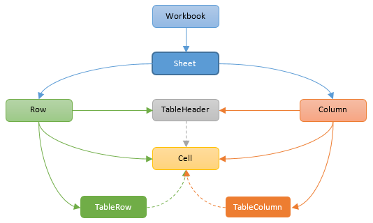

# ExcelGen - An Oracle PL/SQL Generator for MS Excel Files
<p align="center"></p>

ExcelGen is a PL/SQL utility to create Excel files (.xlsx, .xlsb) out of SQL data sources (query strings or cursors), with automatic pagination over multiple sheets.  
It supports encryption, cell merging, various formatting options through a built-in API or CSS, table layout, formulas and defined names.

## Content
* [What's New in...](#whats-new-in)  
* [Bug tracker](#bug-tracker)  
* [Installation](#installation)  
* [Quick Start](#quick-start)  
* [ExcelGen Subprograms and Usage](#excelgen-subprograms-and-usage)  
* [Style specifications](#style-specifications)  
* [Formula Support](#formula-support)
* [Examples](#examples-3)  
* [Copyright and license](#copyright-and-license)  

## What's New in...

> Version 4.0 : defined names and formulas support  
> Version 3.0 : cell API, CSS styling support, multitable sheet, merged cells  
> Version 2.0 : support for XLSB format output  
> Version 1.0 : added encryption features  
> Version 0.1b : Beta version

([Change Log](./CHANGELOG.md))

## Bug tracker

Found a bug, have a question, or an enhancement request?  
Please create an issue [here](https://github.com/mbleron/ExcelGen/issues).

## Installation

### Getting source code

Clone this repository or download it as a zip archive.  

Note : [ExcelCommons](https://github.com/mbleron/ExcelCommons) and [MSUtilities](https://github.com/mbleron/MSUtilities) dependencies are provided as submodules, so use the clone command with recurse-submodules option :  
`git clone --recurse-submodules https://github.com/mbleron/ExcelGen.git`  
or download them separately as zip archives and extract the content of root folders into ExcelCommons and MSUtilities folders respectively.   

### Database requirement

ExcelGen requires Oracle Database 11\.2\.0\.1 and onwards.

### PL/SQL

Using SQL*Plus, connect to the target database schema, then :  
1. Install ExcelGen and dependencies using script [`install.sql`](./install.sql).  
2. If your schema does not have a grant to DBMS_CRYPTO, you can use script [`install_nocrypto.sql`](./install_nocrypto.sql), but will not be able to call the *setEncryption* procedure.

## Quick Start

Basic Excel export from a SQL query :  
```
declare
  ctxId   ExcelGen.ctxHandle;
  sheet1  ExcelGen.sheetHandle;
begin
  ctxId := ExcelGen.createContext();  
  sheet1 := ExcelGen.addSheetFromQuery(ctxId, 'sheet1', 'select * from my_table');
  ExcelGen.setHeader(ctxId, sheet1, p_frozen => true);
  ExcelGen.createFile(ctxId, 'TEST_DIR', 'my_file.xlsx');
  ExcelGen.closeContext(ctxId);
end;
/
```

See the following sections for more examples and detailed description of ExcelGen features.

## Operational Notes

### ExcelGen Model
<p align="center"></p>
The workbook structure is maintained in a context object referenced through its handle during the generation process.  

A workbook contains at least one sheet, and a stylesheet.  
A sheet may contain:  
* zero or more tables
* individual cells

A table is a contiguous rectangular set of cells (range) arranged in rows and columns, with an optional header row, and whose data comes from a SQL source (cursor or query string).

Provided there is only one table declared in a sheet, it is possible to partition the underlying data source across multiple sheets past the first one.  
Similarly, a sheet containing a single table will benefit from a streaming generation model, resulting in a low memory footprint. Otherwise, if the sheet contains multiple tables, or a mix of tables and individual cells, all data will first be built up in memory, then written out to the sheet.

Various styling options are available at sheet, table or cell level, using the built-in API or CSS.
Cell styles are defined globally in the context so that they can be referenced multiple times.

For simple requirements such as a single-table sheet, shortcut procedures and functions [addSheetFromQuery](#addsheetfromquery-procedure-and-function), [addSheetFromCursor](#addsheetfromcursor-procedure-and-function) and related table-agnostic subprograms are available to bypass table management.

## ExcelGen Subprograms and Usage
* Context and file management  
  * [createContext](#createcontext-function)  
  * [closeContext](#closecontext-procedure)  
  * [getFileContent](#getfilecontent-function)  
  * [createFile](#createfile-procedure)  
  * [setEncryption](#setencryption-procedure)  
  * [getProductName](#getproductname-function)  
  * [setCoreProperties](#setcoreproperties-procedure)
* Sheet management  
  * [addSheet](#addsheet-function)
  * [addSheetFromQuery](#addsheetfromquery-procedure-and-function)  
  * [addSheetFromCursor](#addsheetfromcursor-procedure-and-function)  
  * [setSheetProperties](#setsheetproperties-procedure)  
  * [setHeader](#setheader-procedure)  
  * [setTableFormat](#settableformat-procedure)  
  * [setColumnProperties](#setcolumnproperties-procedure)  
  * [setColumnFormat](#setcolumnformat-procedure)  
  * [setRowProperties](#setrowproperties-procedure)
* Table management
  * [addTable](#addtable-function)
  * [setBindVariable](#setbindvariable-procedure)  
  * [setTableHeader](#settableheader-procedure)
  * [setTableProperties](#settableproperties-procedure)
  * [setTableColumnProperties](#settablecolumnproperties-procedure)
  * [setTableColumnFormat](#settablecolumnformat-procedure)
  * [setTableRowProperties](#settablerowproperties-procedure)
  * [addTableColumn](#addtablecolumn-procedure)
  * [addTableColumnBefore](#addtablecolumnbefore-procedure)
  * [addTableColumnAfter](#addtablecolumnafter-procedure)
  * [addTableHyperlinkColumn](#addtablehyperlinkcolumn-procedure)
  * [addTableHyperlinkColumnBefore](#addtablehyperlinkcolumnbefore-procedure)
  * [addTableHyperlinkColumnAfter](#addtablehyperlinkcolumnafter-procedure)
  * [getRowCount](#getrowcount-function)
* Cell management
  * [putCell](#putcell-procedure)
  * [putNumberCell](#putnumbercell-procedure)
  * [putStringCell](#putstringcell-procedure)
  * [putDateCell](#putdatecell-procedure)
  * [putRichTextCell](#putrichtextcell-procedure)
  * [putFormulaCell](#putformulacell-procedure)
  * [putHyperlinkCell](#puthyperlinkcell-procedure)
  * [mergeCells](#mergecells-procedure)
  * [makeCellRef](#makecellref-function)
  * [makeCellRange](#makecellrange-function)
* Formulas and Names  
  * [putDefinedName](#putdefinedname-procedure)
  * [putFormulaCell](#putformulacell-procedure)
  * [addTableColumn](#addtablecolumn-procedure)
  * [addTableColumnBefore](#addtablecolumnbefore-procedure)
  * [addTableColumnAfter](#addtablecolumnafter-procedure)
  * [setCellReferenceStyle](#setcellreferencestyle-procedure)
* Data validation
  * [addDataValidationRule](#adddatavalidationrule-procedure)
  * [setTableColumnValidationRule](#settablecolumnvalidationrule-procedure)
* Style management
  * [setDateFormat](#setdateformat-procedure)  
  * [setTimestampFormat](#settimestampformat-procedure)  
  * [setNumFormat](#setnumformat-procedure)  
  * [makeRgbColor](#makergbcolor-function)  
  * [makeBorderPr](#makeborderpr-function)  
  * [makeBorder](#makeborder-function)  
  * [makeFont](#makefont-function)  
  * [makePatternFill](#makepatternfill-function)  
  * [makeGradientFill](#makegradientfill-function)  
  * [makeGradientStop](#makegradientstop-function)  
  * [addGradientStop](#addgradientstop-procedure)  
  * [makeAlignment](#makealignment-function)  
  * [makeCellStyle](#makecellstyle-function)  
  * [makeCellStyleCss](#makecellstylecss-function)  
  * [setDefaultStyle](#setdefaultstyle-procedure)  
  * [setRangeStyle](#setrangestyle-procedure)  
---

### createContext function
This function creates and returns a new generator handle.  

```sql
function createContext (
  p_type  in pls_integer default FILE_XLSX 
)
return ctxHandle;
```

Parameter|Description|Mandatory
---|---|---
`p_type`|Output file format. <br/>One of `FILE_XLSX`, `FILE_XLSB`. Default is `FILE_XLSX`.|No

---
### closeContext procedure
Releases a context handle previously opened by [createContext](#createcontext-function) function.

```sql
procedure closeContext (
  p_ctxId  in ctxHandle 
);
```

Parameter|Description|Mandatory
---|---|---
`p_ctxId`|Context handle.|Yes

---
### addSheet function
Adds a new empty sheet and returns a sheetHandle value to be used with related subprograms.  

```sql
function addSheet (
  p_ctxId       in ctxHandle
, p_sheetName   in varchar2
, p_tabColor    in varchar2 default null
, p_sheetIndex  in pls_integer default null
, p_state       in pls_integer default null
)
return sheetHandle;
```

Parameter|Description|Mandatory
---|---|---
`p_ctxId`|Context handle.|Yes
`p_sheetName`|Sheet name.|Yes
`p_tabColor`|Tab [color](#color-specification) of the new sheet.|No
`p_sheetIndex`|Sheet tab index in the workbook. <br/>If omitted, the sheet is added at the end of the list, after the last existing index.|No
`p_state`|Visibility state. <br/>One of `ST_VISIBLE` (default), `ST_HIDDEN`, `ST_VERYHIDDEN`.|No

**Notes :**  
The list of sheet indices specified via `p_sheetIndex` may be sparse.  
For example, if one adds sheet 'A' at index 2, sheet 'B' at index 4 and sheet 'C' at index 1, the resulting workbook will show sheets 'C', 'A' and 'B' in that order.  

The `ST_VERYHIDDEN` state is only available programmatically. It indicates that the sheet is hidden and cannot be shown in the Excel UI (contrary to `ST_HIDDEN`).  

---
### addTable function
This function adds a new table to a given sheet, and returns a handle to be used in related subprograms.  
The table may be based on a SQL query string (VARCHAR2 or CLOB) or a weakly-typed ref cursor.  

```sql
function addTable (
  p_ctxId            in ctxHandle
, p_sheetId          in sheetHandle
, p_query            in varchar2
, p_paginate         in boolean default false
, p_pageSize         in pls_integer default null
, p_anchorRowOffset  in pls_integer default null
, p_anchorColOffset  in pls_integer default null
, p_anchorTableId    in tableHandle default null
, p_anchorPosition   in pls_integer default null
, p_maxRows          in integer default null
, p_excludeCols      in varchar2 default null
)
return tableHandle;
```
```sql
function addTable (
  p_ctxId            in ctxHandle
, p_sheetId          in sheetHandle
, p_query            in clob
, p_paginate         in boolean default false
, p_pageSize         in pls_integer default null
, p_anchorRowOffset  in pls_integer default null
, p_anchorColOffset  in pls_integer default null
, p_anchorTableId    in tableHandle default null
, p_anchorPosition   in pls_integer default null
, p_maxRows          in integer default null
, p_excludeCols      in varchar2 default null
)
return tableHandle;
```
```sql
function addTable (
  p_ctxId            in ctxHandle
, p_sheetId          in sheetHandle
, p_rc               in sys_refcursor
, p_paginate         in boolean default false
, p_pageSize         in pls_integer default null
, p_anchorRowOffset  in pls_integer default null
, p_anchorColOffset  in pls_integer default null
, p_anchorTableId    in tableHandle default null
, p_anchorPosition   in pls_integer default null
, p_maxRows          in integer default null
, p_excludeCols      in varchar2 default null
)
return tableHandle;
```

Parameter|Description|Mandatory
---|---|---
`p_ctxId`|Context handle.|Yes
`p_sheetId`|Sheet handle.|Yes
`p_query`|SQL query string (VARCHAR2 or CLOB data type). <br/>Bind variables (if any) can be set via [setBindVariable](#setbindvariable-procedure) procedure.|Yes
`p_rc`|Input ref cursor.|Yes
`p_paginate`|Enables pagination of the input data source over multiple sheets. <br/>Use `p_pageSize` parameter to control the maximum number of rows per sheet.|No
`p_pageSize`|Maximum number of rows per sheet, when pagination is enabled. <br/>If set to NULL, Excel sheet limit is used (1,048,576 rows).|No
`p_anchorRowOffset`|Row offset of the top-left cell of the table. <br/>If `p_anchorTableId` is not NULL, this offset is relative to the table position specified by `p_anchorPosition`, otherwise it is an absolute offset in the sheet.|No
`p_anchorColOffset`|Column offset of the top-left cell of the table. <br/>If `p_anchorTableId` is not NULL, this offset is relative to the table position specified by `p_anchorPosition`, otherwise it is an absolute offset in the sheet.|No
`p_anchorTableId`|Handle of the anchor table.|No
`p_anchorPosition`|Position in the anchor table from which row and column offsets are applied. <br>One of `TOP_LEFT`, `TOP_RIGHT`, `BOTTOM_RIGHT`, `BOTTOM_LEFT`.|No
`p_maxRows`|Maximum number of rows to fetch from the underlying query. <br/>If set to NULL, no limit is applied except Excel sheet limit (unless pagination is enabled).|No
`p_excludeCols`|A comma-separated list of column indices and/or names to exclude from the SQL query result in the spreadsheet output. <br/>Excluded column values are still accessible internally, to be referenced in an hyperlink expression. <br/>Column names are case-sensitive and must be enclosed within quotation marks, e.g. `'1, 2, "MY_COLUMN"'`.|No

**Notes :**  
Allowed SQL column data types are : 
`VARCHAR2`, `CHAR`, `NUMBER`, `DATE`, `TIMESTAMP`, `TIMESTAMP WITH TIME ZONE`, `CLOB`, or `ANYDATA`, which must encapsulate one of the former scalar types.

Pagination of the query results is only possible when this is the only table of the sheet.  

When pagination is enabled, three substitution variables may be used to generate unique names from the input sheet name pattern : 
* PNUM : current page number 
* PSTART : first row number of the current page
* PSTOP : last row number of the current page

For example :  
`sheet${PNUM}` will be expanded to `sheet1`, `sheet2`, `sheet3`, etc.  
`${PSTART}-${PSTOP}` will be expanded to `1-1000`, `1001-2000`, `2001-3000`, etc. assuming a page size of 1000 rows.  

Table positioning may be absolute in the owning sheet, or relative to another table.  
For the former method, row and column offsets correspond to row and column (1-based) indices respectively, and for the latter, offsets are 0-based from one the four anchor table corners:  

  

In this example, the absolute position (row, column) of Cell1 is (7, 5), while relative positions from Table1 corners are:  

TOP_LEFT: (4, 3)  
TOP_RIGHT: (4, 1)  
BOTTOM_RIGHT: (2, 1)  
BOTTOM_LEFT: (2, 3)  

---
### putCell procedure  
Adds or overwrites a cell identified by its row and column indices, in a given sheet. Cell addressing may be absolute or relative to a given table object previously defined.  

```sql
procedure putCell (
  p_ctxId           in ctxHandle
, p_sheetId         in sheetHandle
, p_rowIdx          in pls_integer
, p_colIdx          in pls_integer
, p_value           in anydata default null
, p_style           in cellStyleHandle default null 
, p_anchorTableId   in tableHandle default null
, p_anchorPosition  in pls_integer default null
);
```

Parameter|Description|Mandatory
---|---|---
`p_ctxId`|Context handle.|Yes
`p_sheetId`|Sheet handle.|Yes
`p_rowIdx`|1-based row index of the cell, if `p_anchorTableId` is NULL. Otherwise represents a 0-based row offset from the table anchor position.|Yes
`p_colIdx`|1-based column index of the cell, if `p_anchorTableId` is NULL. Otherwise represents a 0-based column offset from the table anchor position.|Yes
`p_value`|Cell value, provided as an ANYDATA instance. <br/>Supported encapsulated types are: NUMBER, VARCHAR2, DATE, TIMESTAMP, TIMESTAMP WITH TIME ZONE and CLOB.|No
`p_style`|Handle to a cell style created via [makeCellStyle](#makecellstyle-function) or [makeCellStyleCss](#makecellstylecss-function) function.|No
`p_anchorTableId`|Handle of the anchor table.|No
`p_anchorPosition`|Position in the anchor table from which row and column offsets are applied. <br>One of `TOP_LEFT`, `TOP_RIGHT`, `BOTTOM_RIGHT`, `BOTTOM_LEFT`.|No

Three convenience procedures are also provided to directly put a numeric, string or date value: [putNumberCell](#putnumbercell-procedure), [putStringCell](#putstringcell-procedure) and [putDateCell](#putdatecell-procedure).

---
### putNumberCell procedure  
Sets a numeric value in a given cell.
See [putCell](#putcell-procedure) procedure for a description of common parameters.
```sql
procedure putNumberCell (
  p_ctxId           in ctxHandle
, p_sheetId         in sheetHandle
, p_rowIdx          in pls_integer
, p_colIdx          in pls_integer
, p_value           in number
, p_style           in cellStyleHandle default null 
, p_anchorTableId   in tableHandle default null
, p_anchorPosition  in pls_integer default null
);
```

---
### putStringCell procedure  
Sets a string value in a given cell.
See [putCell](#putcell-procedure) procedure for a description of common parameters.
```sql
procedure putStringCell (
  p_ctxId           in ctxHandle
, p_sheetId         in sheetHandle
, p_rowIdx          in pls_integer
, p_colIdx          in pls_integer
, p_value           in varchar2
, p_style           in cellStyleHandle default null 
, p_anchorTableId   in tableHandle default null
, p_anchorPosition  in pls_integer default null
);
```

---
### putDateCell procedure  
Sets a date value in a given cell.
See [putCell](#putcell-procedure) procedure for a description of common parameters.
```sql
procedure putDateCell (
  p_ctxId           in ctxHandle
, p_sheetId         in sheetHandle
, p_rowIdx          in pls_integer
, p_colIdx          in pls_integer
, p_value           in date
, p_style           in cellStyleHandle default null 
, p_anchorTableId   in tableHandle default null
, p_anchorPosition  in pls_integer default null
);
```

---
### putRichTextCell procedure  
Sets a rich text content in a given cell.
See [putCell](#putcell-procedure) procedure for a description of common parameters.
```sql
procedure putRichTextCell (
  p_ctxId           in ctxHandle
, p_sheetId         in sheetHandle
, p_rowIdx          in pls_integer
, p_colIdx          in pls_integer
, p_value           in varchar2
, p_style           in cellStyleHandle default null 
, p_anchorTableId   in tableHandle default null
, p_anchorPosition  in pls_integer default null
);
```

The value passed to this procedure (`p_value`) must be a VARCHAR2 string containing a valid XHTML content.  
See [Style specifications/Rich Text](#rich-text) for more information about the expected syntax and supported XHTML formatting elements.  

---
### putFormulaCell procedure
Sets a formula in a given cell.  
See [putCell](#putcell-procedure) procedure for a description of common parameters.

```sql
procedure putFormulaCell (
  p_ctxId           in ctxHandle
, p_sheetId         in sheetHandle
, p_rowIdx          in pls_integer
, p_colIdx          in pls_integer
, p_value           in varchar2
, p_style           in cellStyleHandle default null 
, p_anchorTableId   in tableHandle default null
, p_anchorPosition  in pls_integer default null
, p_refStyle        in pls_integer default null
);
```

Parameter|Description|Mandatory
---|---|---
`p_value`|Formula string.|Yes
`p_refStyle`|Cell reference style used in the formula. <br/>One of `ExcelFmla.REF_A1` (default) or `ExcelFmla.REF_R1C1`.|No

Example:  

```sql
declare
  ...
  sheet1  ExcelGen.sheetHandle := ExcelGen.addSheet(ctx, 'sheet1');
begin  
  
  ExcelGen.putFormulaCell(ctx, sheet1, 1, 2, 'RC[-1]+1', p_refStyle => ExcelFmla.REF_R1C1);
  
  ExcelGen.putFormulaCell(ctx, sheet1, 2, 2, 'SUM($A$1:$A$10)');
  
  ... 
end;
```

---
### putHyperlinkCell procedure
Sets an hyperlink in a given cell.  
See [putCell](#putcell-procedure) procedure for a description of common parameters.

```sql
procedure putHyperlinkCell (
  p_ctxId           in ctxHandle
, p_sheetId         in sheetHandle
, p_rowIdx          in pls_integer
, p_colIdx          in pls_integer
, p_location        in varchar2
, p_linkName        in varchar2 default null
, p_style           in cellStyleHandle default null 
, p_anchorTableId   in tableHandle default null
, p_anchorPosition  in pls_integer default null
);
```

Parameter|Description|Mandatory
---|---|---
`p_location`|Cf. [addTableHyperlinkColumn](#addtablehyperlinkcolumn-procedure).|Yes
`p_linkName`|Cf. [addTableHyperlinkColumn](#addtablehyperlinkcolumn-procedure).|No

---
### addDataValidationRule procedure

Adds a data validation rule to a collection of ranges.

```sql
procedure addDataValidationRule (
  p_ctxId             in ctxHandle
, p_sheetId           in sheetHandle
, p_type              in varchar2
, p_cellRange         in ExcelTypes.ST_Sqref
, p_value1            in varchar2
, p_value2            in varchar2 default null
, p_operator          in varchar2 default null
, p_allowBlank        in boolean default true
, p_showDropDown      in boolean default null
, p_showErrorMessage  in boolean default null
, p_errorMsg          in varchar2 default null
, p_errorTitle        in varchar2 default null
, p_errorStyle        in varchar2 default null
, p_showInputMessage  in boolean default null
, p_promptMsg         in varchar2 default null
, p_promptTitle       in varchar2 default null
, p_refStyle1         in pls_integer default null
, p_refStyle2         in pls_integer default null
);
```

Parameter|Description|Mandatory
---|---|---
`p_ctxId`|Context handle.|Yes
`p_sheetId`|Sheet handle.|Yes
`p_type`|Type of validation. <br/>One of `'whole'`, `'decimal'`, `'list'`, `'date'`, `'time'`, `'textLength'`, `'custom'`.|Yes
`p_cellRange`|A sequence of ranges to which this validation rule applies, as an `ExcelTypes.ST_Sqref` collection. <br/>Each range represents a rectangular area or a single cell. Helper functions [makeCellRef](#makecellref-function) and [makeCellRange](#makecellrange-function) may be used to create a range expression out of individual row and column indices. <br/>Following Excel conventions, the top-left cell of the last range in the sequence will be used as a point of origin to resolve relative references occurring in this rule's formulas.|Yes
`p_value1`|A formula string representing the first operand of the operator, or the Source/Formula for List/Custom types.|Yes
`p_value2`|A formula string representing the second operand of the operator, when applicable.|No
`p_operator`|Relational operator, when applicable. <br/>One of `'between'`, `'notBetween'`, `'equal'`, `'notEqual'`, `'greaterThan'`, `'greaterThanOrEqual'`, `'lessThan'`, `'lessThanOrEqual'`.|No
`p_allowBlank`|"Ignore blank" flag.|No
`p_showDropDown`|"In-cell dropdown" flag.|No
`p_showErrorMessage`|"Show error alert" flag.|No
`p_errorMsg`|Error message.|No
`p_errorTitle`|Error title.|No
`p_errorStyle`|Error alert style. <br/>One of `'stop'` (default), `'warning'`, `'information'`.|No
`p_showInputMessage`|"Show input message" flag.|No
`p_promptMsg`|Input message.|No
`p_promptTitle`|Input title.|No
`p_refStyle1`|Cell reference style of the first formula (`p_value1`). <br/>One of `ExcelFmla.REF_A1` (default) or `ExcelFmla.REF_R1C1`.|No
`p_refStyle2`|Cell reference style of the second formula (`p_value2`).|No

---
### setTableColumnValidationRule procedure

Adds a data validation rule to a given table column.

```sql
procedure setTableColumnValidationRule (
  p_ctxId             in ctxHandle
, p_sheetId           in sheetHandle
, p_tableId           in tableHandle
, p_columnId          in pls_integer
, p_type              in varchar2
, p_value1            in varchar2
, p_value2            in varchar2 default null
, p_operator          in varchar2 default null
, p_allowBlank        in boolean default true
, p_showDropDown      in boolean default null
, p_showErrorMessage  in boolean default null
, p_errorMsg          in varchar2 default null
, p_errorTitle        in varchar2 default null
, p_errorStyle        in varchar2 default null
, p_showInputMessage  in boolean default null
, p_promptMsg         in varchar2 default null
, p_promptTitle       in varchar2 default null
, p_refStyle1         in pls_integer default null
, p_refStyle2         in pls_integer default null
);
```

Parameter|Description|Mandatory
---|---|---
`p_ctxId`|Context handle.|Yes
`p_sheetId`|Sheet handle.|Yes
`p_tableId`|Table handle.|Yes
`p_columnId`|Column id (1-based index).|Yes
`p_type`|Cf. [addDataValidationRule](#adddatavalidationrule-procedure).|Yes
`p_cellRange`|Cf. [addDataValidationRule](#adddatavalidationrule-procedure).|Yes
`p_value1`|Cf. [addDataValidationRule](#adddatavalidationrule-procedure).|Yes
`p_value2`|Cf. [addDataValidationRule](#adddatavalidationrule-procedure).|No
`p_operator`|Cf. [addDataValidationRule](#adddatavalidationrule-procedure).|No
`p_allowBlank`|Cf. [addDataValidationRule](#adddatavalidationrule-procedure).|No
`p_showDropDown`|Cf. [addDataValidationRule](#adddatavalidationrule-procedure).|No
`p_showErrorMessage`|Cf. [addDataValidationRule](#adddatavalidationrule-procedure).|No
`p_errorMsg`|Cf. [addDataValidationRule](#adddatavalidationrule-procedure).|No
`p_errorTitle`|Cf. [addDataValidationRule](#adddatavalidationrule-procedure).|No
`p_errorStyle`|Cf. [addDataValidationRule](#adddatavalidationrule-procedure).|No
`p_showInputMessage`|Cf. [addDataValidationRule](#adddatavalidationrule-procedure).|No
`p_promptMsg`|Cf. [addDataValidationRule](#adddatavalidationrule-procedure).|No
`p_promptTitle`|Cf. [addDataValidationRule](#adddatavalidationrule-procedure).|No
`p_refStyle1`|Cf. [addDataValidationRule](#adddatavalidationrule-procedure).|No
`p_refStyle2`|Cf. [addDataValidationRule](#adddatavalidationrule-procedure).|No

---
### addSheetFromQuery procedure and function
Adds a new sheet based on a SQL query string (VARCHAR2 or CLOB), with optional pagination.  
Available both as a procedure and a function.  
The function returns a sheetHandle value to be used with related subprograms.    

```sql
procedure addSheetFromQuery (
  p_ctxId       in ctxHandle
, p_sheetName   in varchar2
, p_query       in varchar2
, p_tabColor    in varchar2 default null
, p_paginate    in boolean default false
, p_pageSize    in pls_integer default null
, p_sheetIndex  in pls_integer default null
, p_maxRows     in integer default null
, p_state       in pls_integer default null
, p_excludeCols in varchar2 default null
);
```
```sql
procedure addSheetFromQuery (
  p_ctxId       in ctxHandle
, p_sheetName   in varchar2
, p_query       in clob
, p_tabColor    in varchar2 default null
, p_paginate    in boolean default false
, p_pageSize    in pls_integer default null
, p_sheetIndex  in pls_integer default null
, p_maxRows     in integer default null
, p_state       in pls_integer default null
, p_excludeCols in varchar2 default null
);
```
```sql
function addSheetFromQuery (
  p_ctxId       in ctxHandle
, p_sheetName   in varchar2
, p_query       in varchar2
, p_tabColor    in varchar2 default null
, p_paginate    in boolean default false
, p_pageSize    in pls_integer default null
, p_sheetIndex  in pls_integer default null
, p_maxRows     in integer default null
, p_state       in pls_integer default null
, p_excludeCols in varchar2 default null
)
return sheetHandle;
```
```sql
function addSheetFromQuery (
  p_ctxId       in ctxHandle
, p_sheetName   in varchar2
, p_query       in clob
, p_tabColor    in varchar2 default null
, p_paginate    in boolean default false
, p_pageSize    in pls_integer default null
, p_sheetIndex  in pls_integer default null
, p_maxRows     in integer default null
, p_state       in pls_integer default null
, p_excludeCols in varchar2 default null
)
return sheetHandle;
```

Parameter|Description|Mandatory
---|---|---
`p_ctxId`|Cf. [addSheet](#addsheet-function).|Yes
`p_sheetName`|Cf. [addSheet](#addsheet-function).|Yes
`p_query`|Cf. [addTable](#addtable-function).|Yes
`p_tabColor`|Cf. [addSheet](#addsheet-function).|No
`p_paginate`|Cf. [addTable](#addtable-function).|No
`p_pageSize`|Cf. [addTable](#addtable-function).|No
`p_sheetIndex`|Cf. [addSheet](#addsheet-function).|No
`p_maxRows`|Cf. [addTable](#addtable-function).|No
`p_state`|Cf. [addSheet](#addsheet-function).|No
`p_excludeCols`|Cf. [addTable](#addtable-function).|No

---
### addSheetFromCursor procedure and function
Adds a new sheet based on a weakly-typed ref cursor, with optional pagination.  
Available both as a procedure and a function.  
The function returns a sheetHandle value to be used with related subprograms.  

```sql
procedure addSheetFromCursor (
  p_ctxId       in ctxHandle
, p_sheetName   in varchar2
, p_rc          in sys_refcursor
, p_tabColor    in varchar2 default null
, p_paginate    in boolean default false
, p_pageSize    in pls_integer default null
, p_sheetIndex  in pls_integer default null
, p_maxRows     in integer default null
, p_state       in pls_integer default null
, p_excludeCols in varchar2 default null
);
```
```sql
function addSheetFromCursor (
  p_ctxId       in ctxHandle
, p_sheetName   in varchar2
, p_rc          in sys_refcursor
, p_tabColor    in varchar2 default null
, p_paginate    in boolean default false
, p_pageSize    in pls_integer default null
, p_sheetIndex  in pls_integer default null
, p_maxRows     in integer default null
, p_state       in pls_integer default null
, p_excludeCols in varchar2 default null
)
return sheetHandle;
```

Parameter|Description|Mandatory
---|---|---
`p_ctxId`|Cf. [addSheet](#addsheet-function).|Yes
`p_sheetName`|Cf. [addSheet](#addsheet-function).|Yes
`p_rc`|Cf. [addTable](#addtable-function).|Yes
`p_tabColor`|Cf. [addSheet](#addsheet-function).|No
`p_paginate`|Cf. [addTable](#addtable-function).|No
`p_pageSize`|Cf. [addTable](#addtable-function).|No
`p_sheetIndex`|Cf. [addSheet](#addsheet-function).|No
`p_maxRows`|Cf. [addTable](#addtable-function).|No
`p_state`|Cf. [addSheet](#addsheet-function).|No
`p_excludeCols`|Cf. [addTable](#addtable-function).|No

---
### setBindVariable procedure
This procedure binds a value to a variable from the SQL query associated with a table.  
It is overloaded in two ways:  
* By variable data type: NUMBER, VARCHAR2 or DATE
* By referencing either a table, or only a sheet handle. In the latter case, the first table of the sheet will be used.  

:warning: **Legacy overloads expecting a sheet name are deprecated and will be removed in a future version.**

```sql
procedure setBindVariable (
  p_ctxId      in ctxHandle
, p_sheetId    in sheetHandle
, p_tableId    in tableHandle
, p_bindName   in varchar2
, p_bindValue  in number
);
```
```sql
procedure setBindVariable (
  p_ctxId      in ctxHandle
, p_sheetId    in sheetHandle
, p_tableId    in tableHandle
, p_bindName   in varchar2
, p_bindValue  in varchar2
);
```
```sql
procedure setBindVariable (
  p_ctxId      in ctxHandle
, p_sheetId    in sheetHandle
, p_tableId    in tableHandle
, p_bindName   in varchar2
, p_bindValue  in date
);
```
```sql
procedure setBindVariable (
  p_ctxId       in ctxHandle
, p_sheetId     in sheetHandle
, p_bindName    in varchar2
, p_bindValue   in number
);
```
```sql
procedure setBindVariable (
  p_ctxId      in ctxHandle
, p_sheetId    in sheetHandle
, p_bindName   in varchar2
, p_bindValue  in varchar2
);
```
```sql
procedure setBindVariable (
  p_ctxId      in ctxHandle
, p_sheetId    in sheetHandle
, p_bindName   in varchar2
, p_bindValue  in date
);
```
*Deprecated:*
```sql
procedure setBindVariable (
  p_ctxId      in ctxHandle
, p_sheetName  in varchar2
, p_bindName   in varchar2
, p_bindValue  in number
);
```
```sql
procedure setBindVariable (
  p_ctxId      in ctxHandle
, p_sheetName  in varchar2
, p_bindName   in varchar2
, p_bindValue  in varchar2
);
```
```sql
procedure setBindVariable (
  p_ctxId      in ctxHandle
, p_sheetName  in varchar2
, p_bindName   in varchar2
, p_bindValue  in date
);
```

Parameter|Description|Mandatory
---|---|---
`p_ctxId`|Context handle.|Yes
`p_sheetName`|Sheet name.|Yes
`p_sheetId`|Sheet handle.|Yes
`p_tableId`|Table handle.|Yes
`p_bindName`|Bind variable name.|Yes
`p_bindValue`|Bind variable value.|Yes

---  
### setHeader procedure
This procedure adds a header row to the first table of a given sheet. It should be used only when the sheet contains a single table.  
By default, column names are derived from the SQL source query, but they can be customized individually using [setColumnFormat](#setcolumnformat-procedure) procedure.  

```sql
procedure setHeader (
  p_ctxId       in ctxHandle
, p_sheetName   in varchar2
, p_style       in cellStyleHandle default null
, p_frozen      in boolean default false
, p_autoFilter  in boolean default false
);
```
```sql
procedure setHeader (
  p_ctxId       in ctxHandle
, p_sheetId     in sheetHandle
, p_style       in cellStyleHandle default null
, p_frozen      in boolean default false
, p_autoFilter  in boolean default false
);
```

Parameter|Description|Mandatory
---|---|---
`p_ctxId`|Context handle.|Yes
`p_sheetName`|Sheet name.|Yes
`p_sheetId`|Sheet handle.|Yes
`p_style`|Handle to a cell style created via [makeCellStyle](#makecellstyle-function) or [makeCellStyleCss](#makecellstylecss-function) function.|No
`p_frozen`|Set this parameter to true in order to freeze the header row.|No
`p_autoFilter`|Set this parameter to true in order to add an automatic filter to this sheet.|No

---
### setTableFormat procedure
This procedure applies a table layout to the first table of a given sheet. It should be used only when the sheet contains a single table.  
```sql
procedure setTableFormat (
  p_ctxId      in ctxHandle
, p_sheetId    in sheetHandle
, p_style      in varchar2 default null
);
```
*Deprecated:*
```sql
procedure setTableFormat (
  p_ctxId      in ctxHandle
, p_sheetName  in varchar2
, p_style      in varchar2 default null
);
```

Parameter|Description|Mandatory
---|---|---
`p_ctxId`|Context handle.|Yes
`p_sheetName`|Sheet name.|Yes
`p_sheetId`|Sheet handle.|Yes
`p_styleName`|Name of a predefined Excel table style to apply. <br/>See [Predefined table styles](#predefined-table-styles) for a list of available styles.|No

---
### setSheetProperties procedure
Sets sheet-level properties.

```sql
procedure setSheetProperties (
  p_ctxId                in ctxHandle
, p_sheetId              in sheetHandle
, p_activePaneAnchorRef  in varchar2 default null
, p_showGridLines        in boolean default null
, p_showRowColHeaders    in boolean default null
, p_defaultRowHeight     in number default null
);
```

Parameter|Description|Mandatory
---|---|---
`p_ctxId`|Context handle.|Yes
`p_sheetId`|Sheet handle.|Yes
`p_activePaneAnchorRef`|For frozen panes, reference of the top-left cell of the bottom-right pane. <br/>For example, passing 'A2' will freeze the first row of the sheet.|No
`p_showGridLines`|Hide or show grid lines on the sheet. Default is `true` (show).|No
`p_showRowColHeaders`|Hide or show row and column headers on the sheet. Default is `true` (show).|No
`p_defaultRowHeight`|Default row height on this sheet, in points.|No

---
### setTableProperties procedure
Sets table-level properties.

```sql
procedure setTableProperties (
  p_ctxId              in ctxHandle
, p_sheetId            in sheetHandle
, p_tableId            in tableHandle
, p_style              in varchar2 default null
, p_showFirstColumn    in boolean default false
, p_showLastColumn     in boolean default false
, p_showRowStripes     in boolean default true
, p_showColumnStripes  in boolean default false
, p_tableName          in varchar2 default null
);
```

Parameter|Description|Mandatory
---|---|---
`p_ctxId`|Context handle.|Yes
`p_sheetId`|Sheet handle.|Yes
`p_tableId`|Table handle.|Yes
`p_style`|Name of a predefined Excel table style to apply. <br/>See [Predefined table styles](#predefined-table-styles) for a list of available styles.|No
`p_showFirstColumn`|Highlight first column of the table. Default is `false`.|No
`p_showLastColumn`|Highlight last column of the table. Default is `false`.|No
`p_showRowStripes`|Hide or show row stripes. Default is `true` (show).|No
`p_showColumnStripes`|Hide or show column stripes. Default is `false` (hide).|No
`p_tableName`|Table name. <br/>Must be unique among all tables and other names defined in the workbook. If NULL, a system-generated name will be assigned to this table at creation time.|No

---
### setTableHeader procedure
This procedure adds a header row to a given table, with optional cell style and auto-filtering.  
By default, column names are derived from the SQL source query, but they can be customized individually using [setTableColumnProperties](#settablecolumnproperties-procedure) procedure.  

```sql
procedure setTableHeader (
  p_ctxId       in ctxHandle
, p_sheetId     in sheetHandle
, p_tableId     in tableHandle
, p_style       in cellStyleHandle default null
, p_autoFilter  in boolean default false
);
```

Parameter|Description|Mandatory
---|---|---
`p_ctxId`|Context handle.|Yes
`p_sheetId`|Sheet handle.|Yes
`p_tableId`|Table handle.|Yes
`p_style`|Cell style handle created via [makeCellStyle](#makecellstyle-function) or [makeCellStyleCss](#makecellstylecss-function) function.|No
`p_autoFilter`|If set to `true`, adds an automatic filter to each column.|No

---
### setTableColumnProperties procedure
This procedure sets table-level column properties: column name, cell style and header style.
If a table header is displayed, a column name set this way overrides the SQL name from the source query.  

```sql
procedure setTableColumnProperties (
  p_ctxId        in ctxHandle
, p_sheetId      in sheetHandle
, p_tableId      in pls_integer
, p_columnId     in pls_integer
, p_columnName   in varchar2 default null
, p_style        in cellStyleHandle default null
, p_headerStyle  in cellStyleHandle default null
);
```

Parameter|Description|Mandatory
---|---|---
`p_ctxId`|Context handle.|Yes
`p_sheetId`|Sheet handle.|Yes
`p_tableId`|Table handle.|Yes
`p_columnId`|Column index, referring to its position in the list of visible table columns. <br/>This value might differ from the original index in the SQL source if other columns have been excluded or added afterwards.|Yes
`p_columnName`|Column name.|No
`p_style`|Cell style handle created via [makeCellStyle](#makecellstyle-function) or [makeCellStyleCss](#makecellstylecss-function) function.|No
`p_headerStyle`|Header cell style handle created via [makeCellStyle](#makecellstyle-function) or [makeCellStyleCss](#makecellstylecss-function) function. <br/>This style inherits from the table header style defined via [setTableHeader](#settableheader-procedure) procedure, in priority to higher-level settings (sheet column, sheet or workbook).|No

---
### setTableColumnFormat procedure
This procedure sets table-level column number/date format.  

```sql
procedure setTableColumnFormat (
  p_ctxId     in ctxHandle
, p_sheetId   in sheetHandle
, p_tableId   in pls_integer
, p_columnId  in pls_integer
, p_format    in varchar2
);
```

Parameter|Description|Mandatory
---|---|---
`p_ctxId`|Context handle.|Yes
`p_sheetId`|Sheet handle.|Yes
`p_tableId`|Table handle.|Yes
`p_columnId`|Column index. See [setTableColumnProperties](#settablecolumnproperties-procedure).|Yes
`p_format`|Format string. <br/>It takes precedence over existing settings for NUMBER, DATE or TIMESTAMP data types at workbook, sheet and sheet column level. <br/>The format must follow MS Excel proprietary [syntax](https://support.microsoft.com/en-us/office/create-a-custom-number-format-78f2a361-936b-4c03-8772-09fab54be7f4).  |Yes

---
### setTableRowProperties procedure
This procedure sets table-level row properties: cell style.  

```sql
procedure setTableRowProperties (
  p_ctxId    in ctxHandle
, p_sheetId  in sheetHandle
, p_tableId  in pls_integer
, p_rowId    in pls_integer
, p_style    in cellStyleHandle
);
```

Parameter|Description|Mandatory
---|---|---
`p_ctxId`|Context handle.|Yes
`p_sheetId`|Sheet handle.|Yes
`p_tableId`|Table handle.|Yes
`p_rowId`|Local row index, relative to the beginning of the table.|Yes
`p_style`|Cell style handle created via [makeCellStyle](#makecellstyle-function) or [makeCellStyleCss](#makecellstylecss-function) function.|Yes

---
### addTableColumn procedure
This procedure adds a new calculated (formula-based) column to a given table.  
The column is added at the end of the existing column list, see [addTableColumnBefore](#addtablecolumnbefore-procedure) and [addTableColumnAfter](#addtablecolumnafter-procedure) procedures to insert the new column at a specific position.

```sql
procedure addTableColumn (
  p_ctxId     in ctxHandle
, p_sheetId   in sheetHandle
, p_tableId   in pls_integer
, p_name      in varchar2
, p_value     in varchar2
, p_refStyle  in pls_integer default null
);
```

Parameter|Description|Mandatory
---|---|---
`p_ctxId`|Context handle.|Yes
`p_sheetId`|Sheet handle.|Yes
`p_tableId`|Table handle.|Yes
`p_name`|Column name.|Yes
`p_value`|Formula string.|Yes
`p_refStyle`|Cell reference style. <br/>Cf. [putFormulaCell](#putformulacell-procedure) procedure.|No

---
### addTableColumnBefore procedure
This procedure adds a new calculated column to a given table, before a given column.  

```sql
procedure addTableColumnBefore (
  p_ctxId     in ctxHandle
, p_sheetId   in sheetHandle
, p_tableId   in pls_integer
, p_name      in varchar2
, p_value     in varchar2
, p_columnId  in pls_integer
, p_refStyle  in pls_integer default null
);
```

Parameter|Description|Mandatory
---|---|---
`p_ctxId`|Context handle.|Yes
`p_sheetId`|Sheet handle.|Yes
`p_tableId`|Table handle.|Yes
`p_name`|Column name.|Yes
`p_value`|Formula string.|Yes
`p_columnId`|Column index before which to insert the new column. The index may refer to an excluded column (see [addTable](#addtable-function)).|Yes
`p_refStyle`|Cell reference style.|No

---
### addTableColumnAfter procedure
This procedure adds a new calculated column to a given table, after a given column.  

```sql
procedure addTableColumnAfter (
  p_ctxId     in ctxHandle
, p_sheetId   in sheetHandle
, p_tableId   in pls_integer
, p_name      in varchar2
, p_value     in varchar2
, p_columnId  in pls_integer
, p_refStyle  in pls_integer default null
);
```

Parameter|Description|Mandatory
---|---|---
`p_ctxId`|Context handle.|Yes
`p_sheetId`|Sheet handle.|Yes
`p_tableId`|Table handle.|Yes
`p_name`|Column name.|Yes
`p_value`|Formula string.|Yes
`p_columnId`|Column index after which to insert the new column. The index may refer to an excluded column (see [addTable](#addtable-function)).|Yes
`p_refStyle`|Cell reference style.|No

---
### addTableHyperlinkColumn procedure
This procedure adds a new hyperlink column to a given table.  
The column is added at the end of the existing column list

```sql
procedure addTableHyperlinkColumn (
  p_ctxId     in ctxHandle
, p_sheetId   in sheetHandle
, p_tableId   in tableHandle
, p_name      in varchar2
, p_location  in varchar2
, p_linkName  in varchar2 default null
)
```

Parameter|Description|Mandatory
---|---|---
`p_ctxId`|Context handle.|Yes
`p_sheetId`|Sheet handle.|Yes
`p_tableId`|Table handle.|Yes
`p_name`|Column name.|Yes
`p_location`|Hyperlink target. May be parameterized (see below).|Yes
`p_linkName`|Friendly name. May be parameterized (see below).|No

Internally, ExcelGen creates a new formula-based column using [HYPERLINK](https://support.microsoft.com/en-us/office/hyperlink-function-333c7ce6-c5ae-4164-9c47-7de9b76f577f) function.  
In a table context, we may want the link target or link name to depend on values from other columns in the same row. To achieve that easily, the `p_location` and `p_linkName` parameters allow placeholders for other columns. A placeholder may reference an excluded column.  
Example:  
`'https://www.google.com/search?q=${MY_COLUMN_1}'`

---
### addTableHyperlinkColumnBefore procedure
This procedure adds a new hyperlink column to a given table, before a given column.

```sql
procedure addTableHyperlinkColumnBefore (
  p_ctxId      in ctxHandle
, p_sheetId    in sheetHandle
, p_tableId    in tableHandle
, p_name       in varchar2
, p_columnId   in pls_integer
, p_location   in varchar2
, p_linkName   in varchar2 default null
);
```

Parameter|Description|Mandatory
---|---|---
`p_ctxId`|Context handle.|Yes
`p_sheetId`|Sheet handle.|Yes
`p_tableId`|Table handle.|Yes
`p_name`|Column name.|Yes
`p_columnId`|See [addTableColumnBefore](#addtablecolumnbefore-procedure).|Yes
`p_location`|See [addTableHyperlinkColumn](#addtablehyperlinkcolumn-procedure).|Yes
`p_linkName`|See [addTableHyperlinkColumn](#addtablehyperlinkcolumn-procedure).|No

---
### addTableHyperlinkColumnAfter procedure
This procedure adds a new hyperlink column to a given table, after a given column.

```sql
procedure addTableHyperlinkColumnAfter (
  p_ctxId      in ctxHandle
, p_sheetId    in sheetHandle
, p_tableId    in tableHandle
, p_name       in varchar2
, p_columnId   in pls_integer
, p_location   in varchar2
, p_linkName   in varchar2 default null
);
```

Parameter|Description|Mandatory
---|---|---
`p_ctxId`|Context handle.|Yes
`p_sheetId`|Sheet handle.|Yes
`p_tableId`|Table handle.|Yes
`p_name`|Column name.|Yes
`p_columnId`|See [addTableColumnAfter](#addtablecolumnafter-procedure).|Yes
`p_location`|See [addTableHyperlinkColumn](#addtablehyperlinkcolumn-procedure).|Yes
`p_linkName`|See [addTableHyperlinkColumn](#addtablehyperlinkcolumn-procedure).|No

---
### setDateFormat procedure
This procedure sets the format applied to DATE values in the resulting spreadsheet file.  
It is overloaded to operate either globally in the workbook or at a given sheet level, which takes precedence.  
Current limitation: the format won't apply to date values resulting from formulas.  

The format must follow MS Excel proprietary [syntax](https://support.office.com/en-us/article/format-a-date-the-way-you-want-8e10019e-d5d8-47a1-ba95-db95123d273e).  
Default is `dd/mm/yyyy hh:mm:ss`.  

```sql
procedure setDateFormat (
  p_ctxId   in ctxHandle
, p_format  in varchar2
);
```
```sql
procedure setDateFormat (
  p_ctxId   in ctxHandle
, p_sheetId in sheetHandle
, p_format  in varchar2
);
```

Parameter|Description|Mandatory
---|---|---
`p_ctxId`|Context handle.|Yes
`p_sheetId`|Sheet handle.|Yes
`p_format`|Date format string.|Yes

---
### setTimestampFormat procedure
This procedure sets the format applied to TIMESTAMP values in the resulting spreadsheet file.  
It is overloaded to operate either globally in the workbook or at a given sheet level, which takes precedence.  
Current limitation: the format won't apply to timestamp values resulting from formulas.  

Default is `dd/mm/yyyy hh:mm:ss.000`.  

```sql
procedure setTimestampFormat (
  p_ctxId   in ctxHandle
, p_format  in varchar2
);
```
```sql
procedure setTimestampFormat (
  p_ctxId   in ctxHandle
, p_sheetId in sheetHandle
, p_format  in varchar2
);
```

Parameter|Description|Mandatory
---|---|---
`p_ctxId`|Context handle.|Yes
`p_sheetId`|Sheet handle.|Yes
`p_format`|Timestamp format string.|Yes

---
### setNumFormat procedure
This procedure sets the format applied to NUMBER values in the resulting spreadsheet file.  
It is overloaded to operate either globally in the workbook or at a given sheet level, which takes precedence.  
Current limitation: the format won't apply to numeric values resulting from formulas.  

The format must follow MS Excel proprietary [syntax](https://support.microsoft.com/en-us/office/create-a-custom-number-format-78f2a361-936b-4c03-8772-09fab54be7f4).  
Default is NULL, meaning the General cell format will apply.  

```sql
procedure setNumFormat (
  p_ctxId   in ctxHandle
, p_format  in varchar2
);
```
```sql
procedure setNumFormat (
  p_ctxId   in ctxHandle
, p_sheetId in sheetHandle
, p_format  in varchar2
);
```

Parameter|Description|Mandatory
---|---|---
`p_ctxId`|Context handle.|Yes
`p_sheetId`|Sheet handle.|Yes
`p_format`|Number format string.|Yes

---
### setRowProperties procedure
This procedure sets custom sheet-level row properties for :  style, row height.  

```sql
procedure setRowProperties (
  p_ctxId    in ctxHandle
, p_sheetId  in sheetHandle
, p_rowId    in pls_integer
, p_style    in cellStyleHandle default null
, p_height   in number default null
);
```

Parameter|Description|Mandatory
---|---|---
`p_ctxId`|Context handle.|Yes
`p_sheetId`|Sheet handle.|Yes
`p_rowId`|Row index.|Yes
`p_style`|Cell style handle created via [makeCellStyle](#makecellstyle-function) or [makeCellStyleCss](#makecellstylecss-function) function.|No
`p_height`|Row height in points.|No

---
### setColumnProperties procedure
This procedure sets custom sheet-level column properties for :  style, column header, column width.  

The column header parameter is used to set a custom column name when the sheet is composed of a single table. If there's more than one table defined, it applies to the first table found.  

```sql
procedure setColumnProperties (
  p_ctxId     in ctxHandle
, p_sheetId   in sheetHandle
, p_columnId  in pls_integer
, p_style     in cellStyleHandle default null
, p_header    in varchar2 default null
, p_width     in number default null
);
```

Parameter|Description|Mandatory
---|---|---
`p_ctxId`|Context handle.|Yes
`p_sheetId`|Sheet handle.|Yes
`p_columnId`|Column id (1-based index).|Yes
`p_style`|Handle to a cell style created via [makeCellStyle](#makecellstyle-function) or [makeCellStyleCss](#makecellstylecss-function) function.|No
`p_header`|Column header. Takes precedence over the column name from the source SQL query when the sheet is composed of a single table.|No
`p_width`|Column width. <br/>From [ECMA-376 Standard Part 1](https://www.ecma-international.org/publications-and-standards/standards/ecma-376/) (§ 18.3.1.13): _measured as the number of characters of the maximum digit width of the numbers 0, 1, 2, …, 9 as rendered in the normal style's font_ (currently "Calibri 11pt").|No

---
### setColumnFormat procedure
This procedure sets custom column-level properties:  number/date format, column header, column width.  

It provides the same functionalities as [setColumnProperties](#setcolumnproperties-procedure) except that it only sets the number/date format part of the cell style.  

```sql
procedure setColumnFormat (
  p_ctxId     in ctxHandle
, p_sheetId   in sheetHandle
, p_columnId  in pls_integer
, p_format    in varchar2 default null
, p_header    in varchar2 default null
, p_width     in number default null
);
```

Parameter|Description|Mandatory
---|---|---
`p_ctxId`|Cf. [setColumnProperties](#setcolumnproperties-procedure).|Yes
`p_sheetId`|Cf. [setColumnProperties](#setcolumnproperties-procedure).|Yes
`p_columnId`|Cf. [setColumnProperties](#setcolumnproperties-procedure).|Yes
`p_format`|Format string. <br/>It takes precedence over existing workbook or sheet-level settings for NUMBER, DATE or TIMESTAMP data types. <br/>The format must follow MS Excel proprietary [syntax](https://support.microsoft.com/en-us/office/create-a-custom-number-format-78f2a361-936b-4c03-8772-09fab54be7f4).  |No
`p_header`|Cf. [setColumnProperties](#setcolumnproperties-procedure).|No
`p_width`|Cf. [setColumnProperties](#setcolumnproperties-procedure).|No

---
### setDefaultStyle procedure
This procedure sets the default cell style at workbook or sheet level.  
See [Style inheritance](#style-inheritance) for more information about style propagation at lower levels.  

```sql
procedure setDefaultStyle (
  p_ctxId    in ctxHandle
, p_style    in cellStyleHandle
);
```
```sql
procedure setDefaultStyle (
  p_ctxId    in ctxHandle
, p_sheetId  in sheetHandle
, p_style    in cellStyleHandle
);
```

Parameter|Description|Mandatory
---|---|---
`p_ctxId`|Context handle.|Yes
`p_sheetId`|Sheet handle.|Yes
`p_style`|Handle to a cell style created via [makeCellStyle](#makecellstyle-function) or [makeCellStyleCss](#makecellstylecss-function) function.|Yes

---
### mergeCells procedure
This procedure declares a range of cells to be merged in the resulting sheet.  
The range may be defined by a string expression (overload 1), or by its position and span across rows and columns (overload 2). The latter allows relative positioning from a previously defined table object.  
  
In Excel, the style of the resulting cell is that of the top-left cell of the range, except for borders which are usually not rendered correctly. That's why an optional `p_style` parameter is provided to apply a given style to the range, as if an additional call to [setRangeStyle](#setrangestyle-procedure) were made with `p_outsideBorders` forced to `true`.  

```sql
procedure mergeCells (
  p_ctxId    in ctxHandle
, p_sheetId  in sheetHandle
, p_range    in varchar2
, p_style    in cellStyleHandle default null
);
```
```sql
procedure mergeCells (
  p_ctxId           in ctxHandle
, p_sheetId         in sheetHandle
, p_rowOffset       in pls_integer
, p_colOffset       in pls_integer
, p_rowSpan         in pls_integer
, p_colSpan         in pls_integer
, p_anchorTableId   in tableHandle default null
, p_anchorPosition  in pls_integer default null
, p_style           in cellStyleHandle default null
);
```

Parameter|Description|Mandatory
---|---|---
`p_ctxId`|Context handle.|Yes
`p_sheetId`|Sheet handle.|Yes
`p_range`|Range of cells to merge. <br/>For example: `'C2:E5'`.|Yes
`p_rowOffset`|1-based row index of the top-left cell of the range, if `p_anchorTableId` is NULL. Otherwise represents a 0-based row offset from the table anchor position.|Yes
`p_colOffset`|1-based column index of the top-left cell of the range, if `p_anchorTableId` is NULL. Otherwise represents a 0-based column offset from the table anchor position.|Yes
`p_rowSpan`|Number of rows this range spans.|Yes
`p_colSpan`|Number of columns this range spans.|Yes
`p_anchorTableId`|Handle of the anchor table.|No
`p_anchorPosition`|Position in the anchor table from which row and column offsets are applied. <br>One of `TOP_LEFT`, `TOP_RIGHT`, `BOTTOM_RIGHT`, `BOTTOM_LEFT`.|No
`p_style`|Handle to a cell style created via [makeCellStyle](#makecellstyle-function) or [makeCellStyleCss](#makecellstylecss-function) function.|No

---
### setRangeStyle procedure
This procedure sets the style applied to a given range of cells.  
Just like [mergeCells](#mergecells-procedure) procedure, the range may be defined by a string expression (overload 1), or by its position and span across rows and columns (overload 2). The latter allows relative positioning from a previously defined table object.  

```sql
procedure setRangeStyle (
  p_ctxId           in ctxHandle
, p_sheetId         in sheetHandle
, p_range           in varchar2
, p_style           in cellStyleHandle
, p_outsideBorders  in boolean default false
);
```
```sql
procedure setRangeStyle (
  p_ctxId           in ctxHandle
, p_sheetId         in sheetHandle
, p_rowOffset       in pls_integer
, p_colOffset       in pls_integer
, p_rowSpan         in pls_integer
, p_colSpan         in pls_integer
, p_anchorTableId   in tableHandle default null
, p_anchorPosition  in pls_integer default null
, p_style           in cellStyleHandle
, p_outsideBorders  in boolean default false
);
```

Parameter|Description|Mandatory
---|---|---
`p_ctxId`|Context handle.|Yes
`p_sheetId`|Sheet handle.|Yes
`p_range`|Range of cells. <br/>For example: `'C2:E5'`.|Yes
`p_rowOffset`|1-based row index of the top-left cell of the range, if `p_anchorTableId` is NULL. Otherwise represents a 0-based row offset from the table anchor position.|Yes
`p_colOffset`|1-based column index of the top-left cell of the range, if `p_anchorTableId` is NULL. Otherwise represents a 0-based column offset from the table anchor position.|Yes
`p_rowSpan`|Number of rows this range spans.|Yes
`p_colSpan`|Number of columns this range spans.|Yes
`p_anchorTableId`|Handle of the anchor table.|No
`p_anchorPosition`|Position in the anchor table from which row and column offsets are applied. <br>One of `TOP_LEFT`, `TOP_RIGHT`, `BOTTOM_RIGHT`, `BOTTOM_LEFT`.|No
`p_style`|Handle to a cell style created via [makeCellStyle](#makecellstyle-function) or [makeCellStyleCss](#makecellstylecss-function) function.|Yes
`p_outsideBorders`|Whether to apply this style's border component to the outside of the range only. Default is `false`. <br/>See example below.|No

#### Example
```sql
  ExcelGen.setRangeStyle(
    p_ctxId   => ctx
  , p_sheetId => sheet1
  , p_range   => 'B2:C3'
  , p_style   => ExcelGen.makeCellStyleCss(ctx, 'background:yellow;border:medium solid red')
  );
```


With outside borders only: 
```sql
  ExcelGen.setRangeStyle(
    p_ctxId          => ctx
  , p_sheetId        => sheet1
  , p_range          => 'B2:C3'
  , p_style          => ExcelGen.makeCellStyleCss(ctx, 'background:yellow;border:medium solid red')
  , p_outsideBorders => true
  );
```


---
### makeCellRef function
This function creates a cell reference string from given column and row indices (1-based).  
For example, `makeCellRef(54,8)` will return `'BB8'`.

```sql
function makeCellRef (
  p_colIdx  in pls_integer
, p_rowIdx  in pls_integer
)
return varchar2;
```

Parameter|Description|Mandatory
---|---|---
`p_colIdx`|Column index.|Yes
`p_rowIdx`|Row index.|Yes

---
### makeCellRange function
This function creates a range string expression out of given column and row indices (1-based).  
If last row and column indices are not specified, then a single cell reference is returned.

```sql
function makeCellRange (
  p_startRowIdx  in pls_integer
, p_startColIdx  in pls_integer
, p_endRowIdx    in pls_integer default null
, p_endColIdx    in pls_integer default null
)
return ExcelTypes.ST_Ref;
```

Parameter|Description|Mandatory
---|---|---
`p_startRowIdx`|First row index.|Yes
`p_startColIdx`|First column index.|Yes
`p_endRowIdx`|Last row index.|Yes
`p_endColIdx`|Last column index.|Yes

---
### setEncryption procedure
This procedure sets the password used to encrypt the document, along with the minimum compatible Office version necessary to open it.

```sql
procedure setEncryption (
  p_ctxId       in ctxHandle
, p_password    in varchar2
, p_compatible  in pls_integer default OFFICE2007SP2
);
```

Parameter|Description|Mandatory
---|---|---
`p_ctxId`|Context handle.|Yes
`p_password`|Password.|Yes
`p_compatible`|Minimum compatible Office version for encryption. <br/>One of `OFFICE2007SP1`, `OFFICE2007SP2`, `OFFICE2010`, `OFFICE2013`, `OFFICE2016`. Default is `OFFICE2007SP2`.|No


---
### setCoreProperties procedure
This procedure sets various file properties (metadata) as specified by the [Dublin Core Metadata Initiative](https://www.dublincore.org/specifications/dublin-core/dcmi-terms/) (DCMI).  

```sql
procedure setCoreProperties (
  p_ctxId        in ctxHandle
, p_creator      in varchar2 default null
, p_description  in varchar2 default null
, p_subject      in varchar2 default null
, p_title        in varchar2 default null
);
```

Parameter|Description|Mandatory
---|---|---
`p_ctxId`|Context handle.|Yes
`p_creator`|[Creator](https://www.dublincore.org/specifications/dublin-core/dcmi-terms/elements11/creator/) property. <br/>If NULL, defaults to the product name as returned by [getProductName](#getproductname-function) function.|No
`p_description`|[Description](https://www.dublincore.org/specifications/dublin-core/dcmi-terms/elements11/description/) property.|No
`p_subject`|[Subject](https://www.dublincore.org/specifications/dublin-core/dcmi-terms/elements11/subject/) property.|No
`p_title`|[Title](https://www.dublincore.org/specifications/dublin-core/dcmi-terms/elements11/title/) property.|No


---
### getProductName function
This function returns a string containing the current ExcelGen identifier and version number, e.g. `EXCELGEN-3.6.0`.

```sql
function getProductName
return varchar2;
```

---
### getFileContent function
This function builds the spreadsheet file and returns it as a temporary BLOB.  

```sql
function getFileContent (
  p_ctxId  in ctxHandle
)
return blob; 
```

---
### createFile procedure
This procedure builds the spreadsheet file and write it directly to a directory.  

```sql
procedure createFile (
  p_ctxId      in ctxHandle
, p_directory  in varchar2
, p_filename   in varchar2
);
```

Parameter|Description|Mandatory
---|---|---
`p_ctxId`|Context handle.|Yes
`p_directory`|Target directory.<br/> Must be a valid Oracle directory name.|Yes
`p_filename`|File name.|Yes

---
### getRowCount function
This function returns the total number of rows fetched for a given table.  
The table may be partitioned over multiple sheets.  
This function must be called after [getFileContent](#getfilecontent-function) or [createFile](#createfile-procedure).  

```sql
function getRowCount (
  p_ctxId    in ctxHandle
, p_sheetId  in sheetHandle 
, p_tableId  in tableHandle default null
) 
return pls_integer;
```

Parameter|Description|Mandatory
---|---|---
`p_ctxId`|Context handle.|Yes
`p_sheetId`|Sheet handle.|Yes
`p_tableId`|Table handle.<br/> If NULL or omitted, the first table of the sheet is used.|No

---
### STYLING

### makeRgbColor function
This function builds an RGBA color value in hexadecimal notation from individual Red, Green and Blue components supplied as unsigned 8-bit integers (0-255), and optional Alpha component as a floating-point number between 0 and 1.  
For example:  
`makeRgbColor(219,112,147)` will return `#DB7093`.  
`makeRgbColor(0,255,0,.2)` will return `#00FF0033`.  

```sql
function makeRgbColor (
  r  in uint8
, g  in uint8
, b  in uint8
, a  in number default null
)
return varchar2;
```

Parameter|Description|Mandatory
---|---|---
`r`|Red component value.|Yes
`g`|Green component value.|Yes
`b`|Blue component value.|Yes
`a`|Alpha component value. <br/>See [Color specification](#color-specification) for details on how ExcelGen interprets this value.|No

---
### makeBorderPr function
This function builds an instance of a cell border edge, from a border style name and a color.

```sql
function makeBorderPr (
  p_style  in varchar2 default null
, p_color  in varchar2 default null
)
return CT_BorderPr;
```

Parameter|Description|Mandatory
---|---|---
`p_style`|Border style name. <br/>See [Border styles](#border-styles) for a list of available styles.|No
`p_color`|Border [color](#color-specification).|No

---
### makeBorder function
This function builds an instance of a cell border (all edges).  
It is overloaded to accept either individual edge formatting (left, right, top and bottom), or the same format for all edges.

Overload 1 :  
```sql
function makeBorder (
  p_left    in CT_BorderPr default makeBorderPr()
, p_right   in CT_BorderPr default makeBorderPr()
, p_top     in CT_BorderPr default makeBorderPr()
, p_bottom  in CT_BorderPr default makeBorderPr()
)
return CT_Border;
```

Overload 2 :  
```sql
function makeBorder (
  p_style  in varchar2
, p_color  in varchar2 default null
)
return CT_Border;
```

Overload 2 is a shorthand for : 
```
makeBorder(
  p_left    => makeBorderPr(p_style, p_color)
, p_right   => makeBorderPr(p_style, p_color)
, p_top     => makeBorderPr(p_style, p_color)
, p_bottom  => makeBorderPr(p_style, p_color)
)
```

Parameter|Description|Mandatory
---|---|---
`p_left`|Left edge format, as returned by [makeBorderPr](#makeborderpr-function) function.|No
`p_right`|Right edge format, as returned by [makeBorderPr](#makeborderpr-function) function.|No
`p_top`|Top edge format, as returned by [makeBorderPr](#makeborderpr-function) function.|No
`p_bottom`|Bottom edge format, as returned by [makeBorderPr](#makeborderpr-function) function.|No
`p_style`|Border style name.|Yes
`p_color`|Border [color](#color-specification).|No

---
### makeFont function
This function builds an instance of a cell font.

```sql
function makeFont (
  p_name       in varchar2 default null
, p_sz         in pls_integer default null
, p_b          in boolean default false
, p_i          in boolean default false
, p_color      in varchar2 default null
, p_u          in varchar2 default null
, p_vertAlign  in varchar2 default null
, p_strike     in boolean default false
)
return CT_Font;
```

Parameter|Description|Mandatory
---|---|---
`p_name`|Font name.|Yes
`p_sz`|Font size, in points.|Yes
`p_b`|Bold font style (true\|false).|No
`p_i`|Italic font style (true\|false).|No
`p_color`|Font [color](#color-specification).|No
`p_u`|Underline style. <br/>One of `none`, `single`, `double`, `singleAccounting`, `doubleAccounting`. Default is `none`.|No
`p_vertAlign`|Font vertical alignment: superscript or subscript. <br/>One of `superscript`, `subscript`, or `baseline` (default).|No
`p_strike`|Font strikethrough effect (true\|false).|No

---
### makePatternFill function
This function builds an instance of a cell pattern fill.

```sql
function makePatternFill (
  p_patternType  in varchar2
, p_fgColor      in varchar2 default null
, p_bgColor      in varchar2 default null
)
return CT_Fill;
```

Parameter|Description|Mandatory
---|---|---
`p_patternType`|Pattern type. <br/>See [Pattern types](#pattern-types) for a list of available types.|Yes
`p_fgColor`|Foreground [color](#color-specification) of the pattern.|No
`p_bgColor`|Background [color](#color-specification) of the pattern.|No

Note:  
For a solid fill (no pattern), the color must be specified using the foreground color parameter.  

---
### makeGradientFill function
This function builds an instance of a cell linear gradient fill.

```sql
function makeGradientFill (
  p_degree  in number default null
, p_stops   in CT_GradientStopList default null
)
return CT_Fill;
```

Parameter|Description|Mandatory
---|---|---
`p_degree`|Angle of the linear gradient in degree. <br/>Default is 0, which represents a left-to-right gradient. Increasing the angle rotates the gradient line clockwise. <br/>NB: Excel presumably calculates the gradient in a square box before scaling it to the cell dimensions. So, for example, a gradient rotated 45° right will have its midpoint matching the diagonal of the cell, regardless of its dimensions:  <br/>|No
`p_stops`|List of color-stop points as a collection of `CT_GradientStop` instances. <br/>If the list is NULL, color-stops may be added later via [addGradientStop](#addgradientstop-procedure) procedure.|No

---
### makeGradientStop function
This function builds an instance of a color-stop point to be used in a linear gradient fill definition.

```sql
function makeGradientStop (
  p_position  in number
, p_color     in varchar2
)
return CT_GradientStop;
```

Parameter|Description|Mandatory
---|---|---
`p_position`|Position of this color-stop point on the gradient line. <br/>It must be a number between 0 and 1, where 0 represents the starting point and 1 the ending point of the line.|Yes
`p_color`|[Color](#color-specification) of this stop point.|Yes

---
### addGradientStop procedure
This procedure adds a new color-stop point to an existing linear gradient fill.

```sql
procedure addGradientStop (
  p_fill      in out nocopy CT_Fill
, p_position  in number
, p_color     in varchar2
);
```

Parameter|Description|Mandatory
---|---|---
`p_fill`|Gradient fill instance.|Yes
`p_position`|Cf. [makeGradientStop](#makegradientstop-function).|Yes
`p_color`|Cf. [makeGradientStop](#makegradientstop-function).|Yes

---
### makeAlignment function
This function builds an instance of a cell alignment.

```sql
function makeAlignment (
  p_horizontal    in varchar2 default null
, p_vertical      in varchar2 default null
, p_wrapText      in boolean default false
, p_textRotation  in number default null
, p_verticalText  in boolean default false
, p_indent        in number default null
)
return CT_CellAlignment;
```

Parameter|Description|Mandatory
---|---|---
`p_horizontal`|Horizontal alignment type, one of `left`, `center` or `right`.|No
`p_vertical`|Vertical alignment type, one of `top`, `center` or `bottom`.|No
`p_wrapText`|Cell text wrapping. Default is `false`.|No
`p_textRotation`|Text rotation angle in degree, between -90° and 90°. <br/>Angle zero is the default horizontal text layout, negative values represent clockwise rotation.|No
`p_verticalText`|Vertical text layout (`true`\|`false`). <br/>The text is stacked vertically instead of horizontally (the default).|No
`p_indent`|Text indentation level in the cell, specified as an unsigned integer between 0 and 250, where one unit of indentation corresponds to 3 space characters in the default font. <br/>Indentation has an effect only when horizontal alignment is set to `left`, `right` or `distributed`.|No

Note:  
`p_textRotation` is not compatible with `p_verticalText`. If both are specified, `p_textRotation` takes precedence.

---
### makeCellStyle function
This function builds an instance of a cell style, composed of optional number format, font, fill and border specifications, and returns a handle to it.

```sql
function makeCellStyle (
  p_ctxId       in ctxHandle
, p_numFmtCode  in varchar2 default null
, p_font        in CT_Font default null
, p_fill        in CT_Fill default null
, p_border      in CT_Border default null
, p_alignment   in CT_CellAlignment default null
)
return cellStyleHandle;
```

Parameter|Description|Mandatory
---|---|---
`p_ctxId`|Context handle.|Yes
`p_numFmtCode`|Number format code.|No
`p_font`|Font style instance, as returned by [makeFont](#makefont-function) function.|No
`p_fill`|Fill style instance, as returned by [makePatternFill](#makepatternfill-function) function.|No
`p_border`|Border style instance, as returned by [makeBorder](#makeborder-function) function.|No
`p_alignment`|Cell alignment instance, as returned by [makeAlignment](#makealignment-function) function.|No

Example:  

This sample code creates a cell style composed of the following facets : 
* Font : Calibri, 11 pts, bold face
* Fill : YellowGreen solid fill
* Border : Thick red edges
* Alignment : Horizontally centered
```sql
declare

  ctxId      ExcelGen.ctxHandle;
  cellStyle  ExcelGen.cellStyleHandle;

begin
  ...
 
  cellStyle := ExcelGen.makeCellStyle(
                 p_ctxId     => ctxId
               , p_font      => ExcelGen.makeFont('Calibri',11,true)
               , p_fill      => ExcelGen.makePatternFill('solid','YellowGreen')
               , p_border    => ExcelGen.makeBorder('thick','red')
               , p_alignment => ExcelGen.makeAlignment(horizontal => 'center')
               );
  ...
```

---
### makeCellStyleCss function
This function builds an instance of a cell style, from a CSS style string, and returns a handle to it.  
See [Style specifications/CSS](#css) for all supported features.

```sql
function makeCellStyleCss (
  p_ctxId  in ctxHandle
, p_css    in varchar2
)
return cellStyleHandle;
```

Parameter|Description|Mandatory
---|---|---
`p_ctxId`|Context handle.|Yes
`p_css`|CSS string.|Yes

Example:  

```sql
declare

  ctxId      ExcelGen.ctxHandle;
  cellStyle  ExcelGen.cellStyleHandle;
  
begin
  ...
 
  cellStyle := ExcelGen.makeCellStyleCss(
                 p_ctxId => ctxId
               , p_css   => 'font:bold 11pt Calibri;
                             background:YellowGreen;
                             border:thick solid red;
                             text-align:center'
               );
  ...
```

---
### putDefinedName procedure
This procedure defines a workbook or sheet-level defined name.

```sql
procedure putDefinedName (
  p_ctxId     in ctxHandle
, p_name      in varchar2
, p_value     in varchar2
, p_scope     in sheetHandle default null
, p_comment   in varchar2 default null
, p_cellRef   in varchar2 default null
, p_refStyle  in pls_integer default null
);
```

Parameter|Description|Mandatory
---|---|---
`p_ctxId`|Context handle.|Yes
`p_name`|Name of this defined name.|Yes
`p_value`|Reference (formula string) for the name.|Yes
`p_scope`|Scope of this name, either a `sheetHandle` for a sheet-level name, or `NULL` (the default) for global workbook level.|No
`p_comment`|Comment for this name.|No
`p_cellRef`|Optional point of origin (cell reference) to resolve offsets when the name uses relative cell references. Default is `A1`. See example below.|No
`p_refStyle`|Cell reference style used in the formula. <br/>One of `ExcelFmla.REF_A1` (default) or `ExcelFmla.REF_R1C1`.|No

Examples:  

```sql
declare
  ...
  sheet1  ExcelGen.sheetHandle := ExcelGen.addSheet(ctx, 'sheet1');
  sheet2  ExcelGen.sheetHandle := ExcelGen.addSheet(ctx, 'sheet2');
begin  
  
  ExcelGen.putDefinedName(ctx, 'TEST1', 'sheet2!$A$1', p_comment => 'This is a workbook-level name');
  ExcelGen.putDefinedName(ctx, 'TEST2', 'sheet1!$A$1', sheet1);
  ExcelGen.putDefinedName(ctx, 'TEST3', 'sheet1!$A$1', sheet2);
  ExcelGen.putDefinedName(ctx, 'TEST3', 'SUM(sheet1!$A$2:$B$6)');
  ExcelGen.putDefinedName(ctx, 'TEST4', 'CSC(1)');
  ExcelGen.putDefinedName(ctx, 'TEST5', 'TEST4 + 1');
  ExcelGen.putDefinedName(ctx, 'TEST6', 'sheet2:sheet1!$A$1');
  ExcelGen.putDefinedName(ctx, 'TEST7', 'INDIRECT("$A$1")');
  ExcelGen.putDefinedName(ctx, 'TEST8', 'sheet1!C3', sheet1, p_cellRef => 'B2');
  
  ... 
end;
```

In the example above, `TEST8` refers to the relative cell reference `C3`. Internally, Excel saves it as row and column offsets, so that the actual reference changes depending on the cell the name is used. That's why ExcelGen needs a point of origin to compute those offsets in the first place.  
Here, if `B2` is used as origin, `C3` defines an offset of one row down and one column to the right.

---
### setCellReferenceStyle procedure
This procedure sets the cell reference style used to display formula expressions in the Excel UI, which is A1-style by default.  
This setting does **not** control the default reference style used to parse formula via [putDefinedName](#putdefinedname-procedure), [addTableColumn](#addtablecolumn-procedure) or [putFormulaCell](#putformulacell-procedure) procedures.

```sql
procedure putDefinedName (
  p_ctxId     in ctxHandle
, p_refStyle  in pls_integer
);
```

Parameter|Description|Mandatory
---|---|---
`p_ctxId`|Context handle.|Yes
`p_refStyle`|Cell reference style, one of `ExcelFmla.REF_A1` or `ExcelFmla.REF_R1C1`.|No

## Style specifications

### CSS
As of ExcelGen 3, it is possible to declare cell styles using CSS syntax, in addition to the built-in styling API.  
Standard CSS properties and values relevant for cell styling are supported, e.g. `border`, `font`, `background`, `color` etc. along with MS Office extensions.  

#### Examples
  
CSS declaration:  
```css
font:14pt "Arial Black";
color:red;
border:double #5B9BD5;
text-align:center;
vertical-align:middle;
```
Equivalent Style API declaration via [makeCellStyle](#makecellstyle-function) : 
```sql
p_font => ExcelGen.makeFont(p_name => 'Arial Black', p_sz => 14, p_color => 'red'), 
p_border => ExcelGen.makeBorder(p_style => 'double', p_color => '#5B9BD5'), 
p_alignment => ExcelGen.makeAlignment(p_horizontal => 'center', p_vertical => 'center')
```


  
CSS declaration:  
```css
font-style:italic;text-decoration:underline;background:orange
```
Equivalent Style API declaration via [makeCellStyle](#makecellstyle-function) : 
```sql
p_font => ExcelGen.makeFont(p_i => true, p_u => 'single'), 
p_fill => ExcelGen.makePatternFill('solid', 'orange')
```


  
CSS declaration:  
```css
font-weight:bold;border-top:medium dashed;border-bottom:medium dashed;vertical-align:top
```
Equivalent Style API declaration via [makeCellStyle](#makecellstyle-function) : 
```sql
p_font => ExcelGen.makeFont(p_b => true), 
p_border => ExcelGen.makeBorder(p_top => ExcelGen.makeBorderPr('mediumDashed')
                              , p_bottom => ExcelGen.makeBorderPr('mediumDashed')), 
p_alignment => ExcelGen.makeAlignment(p_vertical => 'top')
```


#### Supported CSS properties

Hereafter is the exhaustive list of supported properties and values, and implementation-specific features.  
Since there is no exact match between MS Office styling elements and CSS properties, mapping tables are also provided further down in the document.  

Default values are <ins>underlined</ins>, and MSO extensions are *italicized*.  

Name|Description  |Standard
:--|:--|:--
[border](https://developer.mozilla.org/en-US/docs/Web/CSS/border)|`border` shorthand property. <br/>Not all combinations of individually supported `border-style` and `border-width` values actually match an Excel border style. See [Border CSS Mapping](#border-css-mapping) for details.|:heavy_check_mark:
[border-style](https://developer.mozilla.org/en-US/docs/Web/CSS/border-style)|`border-style` shorthand property. <br/>Supported values: <ins>`none`</ins>, `solid`, `dashed`, `dotted`, `double`, *`hairline`*, *`dot-dash`*, *`dot-dot-dash`*, *`dot-dash-slanted`*.|:heavy_check_mark:
[border-width](https://developer.mozilla.org/en-US/docs/Web/CSS/border-width)|`border-width` shorthand property. <br/>Supported values: `thin`, <ins>`medium`</ins>, `thick`.|:heavy_check_mark:
[border-color](https://developer.mozilla.org/en-US/docs/Web/CSS/border-color)|`border-color` shorthand property. <br/>Supported values: see [Color specification](#color-specification).|:heavy_check_mark:
[border-left](https://developer.mozilla.org/en-US/docs/Web/CSS/border-left)|`border-left` shorthand property.|:heavy_check_mark:
[border-right](https://developer.mozilla.org/en-US/docs/Web/CSS/border-right)|`border-right` shorthand property.|:heavy_check_mark:
[border-top](https://developer.mozilla.org/en-US/docs/Web/CSS/border-top)|`border-top` shorthand property.|:heavy_check_mark:
[border-bottom](https://developer.mozilla.org/en-US/docs/Web/CSS/border-bottom)|`border-bottom` shorthand property.|:heavy_check_mark:
[border-left-style](https://developer.mozilla.org/en-US/docs/Web/CSS/border-left-style)|`border-left-style` property.|:heavy_check_mark:
[border-left-width](https://developer.mozilla.org/en-US/docs/Web/CSS/border-left-width)|`border-left-width` property.|:heavy_check_mark:
[border-left-color](https://developer.mozilla.org/en-US/docs/Web/CSS/border-left-color)|`border-left-color` property.|:heavy_check_mark:
[border-right-style](https://developer.mozilla.org/en-US/docs/Web/CSS/border-right-style)|`border-right-style` property.|:heavy_check_mark:
[border-right-width](https://developer.mozilla.org/en-US/docs/Web/CSS/border-right-width)|`border-right-width` property.|:heavy_check_mark:
[border-right-color](https://developer.mozilla.org/en-US/docs/Web/CSS/border-right-color)|`border-right-color` property.|:heavy_check_mark:
[border-top-style](https://developer.mozilla.org/en-US/docs/Web/CSS/border-top-style)|`border-top-style` property.|:heavy_check_mark:
[border-top-width](https://developer.mozilla.org/en-US/docs/Web/CSS/border-top-width)|`border-top-width` property.|:heavy_check_mark:
[border-top-color](https://developer.mozilla.org/en-US/docs/Web/CSS/border-top-color)|`border-top-color` property.|:heavy_check_mark:
[border-bottom-style](https://developer.mozilla.org/en-US/docs/Web/CSS/border-bottom-style)|`border-bottom-style` property.|:heavy_check_mark:
[border-bottom-width](https://developer.mozilla.org/en-US/docs/Web/CSS/border-bottom-width)|`border-bottom-width` property.|:heavy_check_mark:
[border-bottom-color](https://developer.mozilla.org/en-US/docs/Web/CSS/border-bottom-color)|`border-bottom-color` property.|:heavy_check_mark:
[font](https://developer.mozilla.org/en-US/docs/Web/CSS/font)|`font` shorthand property. <br/>ExcelGen only supports `font-family`, `font-size`, `font-style` and `font-weight` components.|:heavy_check_mark:
[font-family](https://developer.mozilla.org/en-US/docs/Web/CSS/font-family)|Font family name.|:heavy_check_mark:
[font-size](https://developer.mozilla.org/en-US/docs/Web/CSS/font-size)|Font size. <br/>ExcelGen only supports value in point unit, e.g. `11pt`.|:heavy_check_mark:
[font-style](https://developer.mozilla.org/en-US/docs/Web/CSS/font-style)|Font style. <br/>Supported values: <ins>`normal`</ins>, `italic`.|:heavy_check_mark:
[font-weight](https://developer.mozilla.org/en-US/docs/Web/CSS/font-weight)|Font weight. <br/>Supported values: <ins>`normal`</ins>, `bold`.|:heavy_check_mark:
[text-decoration](https://developer.mozilla.org/en-US/docs/Web/CSS/text-decoration)|`text-decoration` shorthand property.  <br/>ExcelGen only supports `text-decoration-line` and `text-decoration-style` components.|:heavy_check_mark:
[text-decoration-line](https://developer.mozilla.org/en-US/docs/Web/CSS/text-decoration-line)|Kind of text decoration. <br/>Supported values: <ins>`none`</ins>, or at least one of `underline`, `line-through`. <br/>The value `line-through` maps to Excel font effect 'Strikethrough'.|:heavy_check_mark:
[text-decoration-style](https://developer.mozilla.org/en-US/docs/Web/CSS/text-decoration-style)|Style of the text decoration line. <br>Supported values: <ins>`solid`</ins>, `double`, *`single-accounting`*, *`double-accounting`*. <br/>This style only applies in conjunction with `underline` decoration line value.|:heavy_check_mark:
[vertical-align](https://developer.mozilla.org/en-US/docs/Web/CSS/vertical-align)|`vertical-align` property. <br/>Supported values: `top`, `middle`, `bottom`, *`justify`*, *`distributed`*, `baseline`, `sub`, `super`. <br/>Last two values `sub` and `super` map to Excel font effects 'Subscript' and 'Superscript' respectively.|:heavy_check_mark:
[text-align](https://developer.mozilla.org/en-US/docs/Web/CSS/text-align)|`text-align` property. <br/>Supported values: `left`, `center`, `right`, `justify`, *`fill`*, *`center-across`*, *`distributed`*.|:heavy_check_mark:
[white-space](https://developer.mozilla.org/en-US/docs/Web/CSS/white-space)|`white-space` property. <br/>Supported values: <ins>`pre`</ins>, `pre-wrap`. <br/>Default value is `pre`, which maps to the default "no wrap" mode for a cell.|:heavy_check_mark:
[color](https://developer.mozilla.org/en-US/docs/Web/CSS/color)|`color` property, sets the text and text decoration color. <br/>Supported values: see [Color specification](#color-specification).|:heavy_check_mark:
[background](https://developer.mozilla.org/en-US/docs/Web/CSS/background)|`background` shorthand property. <br/>ExcelGen only supports a single `background-color` or `background-image` component (see below).|:heavy_check_mark:
[background-color](https://developer.mozilla.org/en-US/docs/Web/CSS/background-color)|`background-color` property, sets the background color of the cell. <br/>When the pattern type is set to `none` (the default), specifying a color via this property defines a solid fill. <br/>Supported values: see [Color specification](#color-specification).|:heavy_check_mark:
[background-image](https://developer.mozilla.org/en-US/docs/Web/CSS/background-image)|`background-image` property. <br/>ExcelGen only supports a single gradient value specified via [linear-gradient()](https://developer.mozilla.org/en-US/docs/Web/CSS/gradient/linear-gradient) function.|:heavy_check_mark:
[rotate](https://developer.mozilla.org/en-US/docs/Web/CSS/rotate)|`rotate` property. <br/>Excel only supports a single angle value in `deg`, `turn` or `rad` unit, in the range [-90°, 90°]. <br/>Following CSS convention, a positive angle value rotates clockwise.|:heavy_check_mark:
[text-orientation](https://developer.mozilla.org/en-US/docs/Web/CSS/text-orientation)|`text-orientation` property. <br/>The only supported value is `upright`, which maps to "Vertical Text" font property in Excel. <br/>Contrary to CSS specs, and for the sake of simplicity, this property does not require an explicit vertical [`writing-mode`](https://developer.mozilla.org/en-US/docs/Web/CSS/writing-mode) property set alongside it.|:heavy_check_mark:
mso-char-indent-count|Text indentation level, in the range [0, 250]. <br/>See `p_indent` parameter of [makeAlignment](#makealignment-function) function for more details.|:x:
mso-pattern|Fill pattern type. <br/>Supported values: <ins>*`none`*</ins>, *`gray-50`*, *`gray-75`*, *`gray-25`*, *`horz-stripe`*, *`vert-stripe`*, *`reverse-dark-down`*, *`diag-stripe`*, *`diag-cross`*, *`thick-diag-cross`*, *`thin-horz-stripe`*, *`thin-vert-stripe`*, *`thin-reverse-diag-stripe`*, *`thin-diag-stripe`*, *`thin-horz-cross`*, *`thin-diag-cross`*, *`gray-125`*, *`gray-0625`*. <br/><br/>See [Pattern CSS Mapping](#pattern-css-mapping) for details.|:x:
mso-number-format|Number/Date format string. <br/>e.g. `"0.00"`, `"yyyy-mm-dd"`|:x:


### Color specification
Color values expected in style-related subprograms may be specified using one of the following conventions : 

* Hexadecimal notation, with an optional alpha channel (i.e. transparency), prefixed with a hash sign: `#RRGGBB[AA]`, e.g. `#7FFFD4`.  
Function [makeRgbColor](#makergbcolor-function) can be used to build such a color code from individual RGBA components.

* Named color from the [CSS Color 4](https://www.w3.org/TR/css-color-4/#named-colors) specification, e.g. `Aquamarine`.  The name is case-insensitive.  

* CSS only: [rgb()](https://developer.mozilla.org/en-US/docs/Web/CSS/color_value/rgb) or [rgba()](https://developer.mozilla.org/en-US/docs/Web/CSS/color_value/rgba) functions. Both syntaxes `rgb(R, G, B[, A])` and `rgb(R G B[ / A])` are supported.

**Note:**
Although the [ECMA-376](https://www.ecma-international.org/wp-content/uploads/ECMA-376-Fifth-Edition-Part-1-Fundamentals-And-Markup-Language-Reference.zip) standard seems to support it, the alpha channel is actually ignored when Excel renders the color on screen. There's also no way to specify the alpha component via Excel UI.  
However, ExcelGen supports it *somehow* by blending colors having an alpha component with a white background, thus generating a new opaque color visually equivalent to the transparent color.  

For example, the following code snippet
```sql
  for i in 0 .. 10 loop
    ExcelGen.putCell(ctx, sheet1, 1, i+1, p_style => ExcelGen.makeCellStyleCss(ctx, 'background-color:#FF0000'||to_char(i*25.5,'FM0X')));
  end loop;
```
will generate:  


### Gradient
ExcelGen supports a linear gradient cell background specified via the built-in API [makeGradientFill](#makegradientfill-function), or CSS `background`/`background-image` properties.  
Internally, an Excel gradient fill is composed of a sequence of color stops, and an angle of rotation for the gradient line. Each stop is defined by its position along the gradient line, from 0 to 1 inclusive, and a color. Between two adjacent stops, the color is determined by linear interpolation, the 50% color mix being half-way.  

ExcelGen implements the [linear-gradient()](https://developer.mozilla.org/en-US/docs/Web/CSS/gradient/linear-gradient) CSS function with the following differences from the standard : 
* **Transition hint**:  
When linear-gradient defines a color [transition hint](https://drafts.csswg.org/css-images-4/#coloring-gradient-line), the transition to and from the 50% mix is not linear but exponential. Since Excel does not support that natively,  ExcelGen uses a linear transition instead.  
* **Gradient angle**:  
*First, please bear in mind that Excel and CSS have different conventions regarding angle zero. In Excel, it corresponds to a left-to-right orientation while CSS defines its zero as a bottom-to-top orientation. And to confuse things a bit more, the optional angle parameter in linear-gradient() CSS function does not default to 0deg but corresponds to a top-to-bottom orientation, i.e. 180deg.*
  CSS Orientation|CSS angle*|Excel angle
  --|--|--
  to top|0deg / 0turn|-90
  to top right|45deg / 0.125turn|-45
  to right|90deg / 0.25turn|0
  to bottom right|135deg / 0.375turn|45
  to bottom|180deg / 0.5turn|90
  to bottom left|225deg / 0.625turn|135
  to left|270deg / 0.75turn|180
  to top left|315deg / 0.875turn|225
  
  *(\*) when rendered in a square box*

  Somehow, Excel renders a gradient fill as if the cell were a square box, then scales it to the actual cell dimensions. Therefore, there is a difference in the way the angle is interpreted in Excel vs. CSS.  
If the gradient orientation is specified as a "side-or-corner" value in CSS, it will be rendered identically in Excel, as per the above table.  
However, a 45deg CSS angle in an arbitrary rectangular box is not the same as the corresponding Excel angle (-45° in this case): 

  |
  --|--
  standard CSS|Excel

* **Color stop positions:**  
Color stop and transition hint positions outside the range [0% - 100%] are not supported.

#### Examples

```css
background-image: linear-gradient(to top, #dbdcd7 0%, #dddcd7 24%, #e2c9cc 30%, #e7627d 46%, #b8235a 59%, #801357 71%, #3d1635 84%, #1c1a27 100%)
```
  
&nbsp;  

```css
background: linear-gradient(89.2deg, rgb(0, 0, 0) 10.4%, rgb(255, 0, 0) 37.1%, rgb(255, 216, 51) 64.3%, rgb(255, 255, 255) 90.5%)
```

&nbsp;  

```css
background: 
    linear-gradient(109.6deg, 
        rgb(33, 25, 180) 11.2%, 
        rgb(253, 29, 29) 55.2%, 
        rgb(252, 176, 69) 91.1%
    )
```

&nbsp;  

### Rich Text

ExcelGen supports Rich Text for cell content. That allows the user to style sequences of characters (aka "text runs") individually, instead of formatting the cell text as a whole.  
A Rich Text content must be specified as a string representing a valid XHTML fragment. Here are the supported formatting elements:  
Tag|Description
--|--
`<b></b>`|Puts text in **bold**
`<i></i>`|Puts text in *italic*
`<s></s>`|Strikethrough
`<u></u>`|Underlines text with a single line
`<span style=""></span>`|Applies [CSS](#css) provided in the style attribute
`<sub></sub>`|Puts text in <sub>subscript</sub>
`<sup></sup>`|Puts text in <sup>superscript</sup>
`<br/>`|Puts a line break

If the cell already has a font style defined, text runs will inherit from it.  

#### Examples
* Rich Text with cell style inheritance  
In this first example, the Rich Text feature is used to apply a different color to each character, while the font size and weight is set at cell level:  
```sql
style1 := ExcelGen.makeCellStyleCss(ctx, 'font-size:20pt;font-weight:bold');

ExcelGen.putRichTextCell(
  p_ctxId => ctx
, p_sheetId => sheet1
, p_rowIdx => 1
, p_colIdx => 1
, p_value => 
   '<span style="color:#FF0000">R</span>
    <span style="color:#FFFF00">A</span>
    <span style="color:#00FF00">I</span>
    <span style="color:#00FFFF">N</span>
    <span style="color:#0000FF">B</span>
    <span style="color:#FF00FF">O</span>
    <span style="color:#FF0000">W</span>'
, p_style => style1
);
```
  

* Inline formatting with nested styling elements  
```sql
ExcelGen.putRichTextCell(
  p_ctxId   => ctx
, p_sheetId => sheet1
, p_rowIdx  => 2
, p_colIdx  => 1
, p_value   => 
  'The chemical formula of glucose is <span style="color:blue;font-weight:bold">'||regexp_replace('C6H12O6','(\d+)','<sub>\1</sub>')||'</span>'
);
```
  


### Predefined table styles  

__Light__  


__Medium__  


__Dark__  


### Border styles


#### *Border CSS Mapping*
border-width &#8594;<br/>&#8595; border-style|`thin`|`medium`|`thick`  
--|--|--|--
**`none`**|none|none|none
**`solid`**|thin|medium|thick
**`dashed`**|dashed|mediumDashed|mediumDashed
**`dotted`**|dotted|dotted|dotted
**`double`**|double|double|double
**`hairline`**|hair|hair|hair
**`dot-dash`**|dashDot|mediumDashDot|mediumDashDot
**`dot-dot-dash`**|dashDotDot|mediumDashDotDot|mediumDashDotDot
**`dot-dash-slanted`**|slantDashDot|slantDashDot|slantDashDot
   
### Alignments
#### *Horizontal alignment*
Alignment type|CSS `text-align` value
--|--
left|left
center|center
right|right
fill|fill
justify|justify
centerContinuous|center-across
distributed|distributed

#### *Vertical alignment*
Alignment type|CSS `vertical-align` value
--|--
top|top
center|middle
bottom|bottom
justify|justify
distributed|distributed

CSS values `sub` and `super` are also supported and map to Excel font attributes 'Subscript' and 'Superscript' respectively.  

### Pattern types


#### *Pattern CSS Mapping*
Pattern type|`mso-pattern` value
--|--
none|-
solid|none
mediumGray|gray-50
darkGray|gray-75
lightGray|gray-25
darkHorizontal|horz-stripe
darkVertical|vert-stripe
darkDown|reverse-dark-down
darkUp|diag-stripe
darkGrid|diag-cross
darkTrellis|thick-diag-cross
lightHorizontal|thin-horz-stripe
lightVertical|thin-vert-stripe
lightDown|thin-reverse-diag-stripe
lightUp|thin-diag-stripe
lightGrid|thin-horz-cross
lightTrellis|thin-diag-cross
gray125|gray-125
gray0625|gray-0625


### Style inheritance

Cell styles may be defined at different levels according to the below diagram.  
When a given style component is not set at a specific level, it will automatically inherit its value from the containing element, in cascade.  


**Caveats:**  
* A style component defined at workbook or sheet level is "virtual", i.e. it will only apply when a lower-level and explicitly defined style inherits from it.  
For example, setting a cell background at sheet level does not automatically set that background to all cells of the sheet,  but only to those cells whose styles inherit from the sheet-level style, either directly or through its containing (table) row or (table) column.  
* Column-level settings, even inherited, take precedence over row-level's.
For instance, the following piece of code sets the horizontal alignment for column #2, the background color for row #2, and a default background color at sheet level:  
  ```sql
  ExcelGen.setColumnProperties(ctx, sheet1, 2, ExcelGen.makeCellStyleCss(ctx, 'text-align:center'));
  ExcelGen.setRowProperties(ctx, sheet1, 2, ExcelGen.makeCellStyleCss(ctx, 'background-color:lightgreen'));
  ExcelGen.setDefaultStyle(ctx, sheet1, ExcelGen.makeCellStyleCss(ctx, 'background-color:violet'));
  ExcelGen.putStringCell(ctx, sheet1, 2, 2, 'X');
  ```
  Since the style declared for column #2 does not set the background color component, it inherits the sheet-level value, and since column-level value takes precedence, cell at B2 will have a violet background:  


## Formula Support

ExcelGen supports the following formula-related features for both XLSX and XLSB formats:
* Single-cell formulas
  * [putFormulaCell](#putformulacell-procedure)
* Shared formulas (in tables)
  * [addTableColumn](#addtablecolumn-procedure)
  * [addTableColumnBefore](#addtablecolumnbefore-procedure)
  * [addTableColumnAfter](#addtablecolumnafter-procedure)
* Defined names
  * [putDefinedName](#putdefinedname-procedure)
* A1 and R1C1 reference styles

What is **not** supported (yet):  
* Legacy and [dynamic array formulas](https://support.microsoft.com/en-us/office/dynamic-array-formulas-and-spilled-array-behavior-205c6b06-03ba-4151-89a1-87a7eb36e531)  
* [Structured references](https://support.microsoft.com/en-us/office/using-structured-references-with-excel-tables-f5ed2452-2337-4f71-bed3-c8ae6d2b276e)

Formulas must be entered in English locale, specifically:
* Decimal separator = `.` (dot)
* Argument separator, union operator, array row-item separator = `,` (comma)
* Array row separator = `;` (semicolon)
* English function names

### Supported Excel functions  

The list of supported functions is available [here](https://github.com/mbleron/ExcelCommons/blob/main/resources/excel-functions.csv).


## Examples

* [Single query to sheet mapping, with header formatting](#single-query-to-sheet-mapping-with-header-formatting)
* [Multiple queries, with table layout](#multiple-queries-with-table-layout)
* [Ref cursor paginated over multiple sheets](#ref-cursor-paginated-over-multiple-sheets)
* [Multisheet with pagination, another example](#multisheet-with-pagination-another-example)
* [Creating an encrypted XLSB file](#creating-an-encrypted-xlsb-file)
* [Setting sheet or column-level cell formats](#setting-sheet-or-column-level-cell-formats)
* [Cell merging](#cell-merging)
* [Relative positioning](#relative-positioning)
* [Master-details](#master-details)
* [Variant column data type](#variant-column-data-type)
* [Color spectrum demo](#color-spectrum-demo)
* [Style showcase](#style-showcase)
* [Formulas and Names](#formulas-and-names)
* [Hyperlinks](#hyperlinks)

#### Single query to sheet mapping, with header formatting
[employees.sql](./test_cases/employees.sql) &#8594; [employees.xlsx](./samples/employees.xlsx)

```	
declare

  ctxId      ExcelGen.ctxHandle;
  sheetId    ExcelGen.sheetHandle;
  sqlQuery   varchar2(32767) := 'select * from hr.employees';
  
begin
  
  ctxId := ExcelGen.createContext();  
  sheetId := ExcelGen.addSheetFromQuery(ctxId, 'sheet1', sqlQuery);
      
  ExcelGen.setHeader(
    ctxId
  , sheetId
  , p_style => ExcelGen.makeCellStyle(
                 p_ctxId => ctxId
               , p_font  => ExcelGen.makeFont('Calibri',11,true)
               , p_fill  => ExcelGen.makePatternFill('solid','LightGray')
               )
  , p_frozen     => true
  , p_autoFilter => true
  );
  
  ExcelGen.setDateFormat(ctxId, 'dd/mm/yyyy');
  
  ExcelGen.createFile(ctxId, 'TEST_DIR', 'employees.xlsx');
  ExcelGen.closeContext(ctxId);
  
end;
/
```

#### Multiple queries, with table layout
[dept-emp.sql](./test_cases/dept-emp.sql) &#8594; [dept-emp.xlsx](./samples/dept-emp.xlsx)

```
declare

  ctxId   ExcelGen.ctxHandle;
  sheet1  ExcelGen.sheetHandle;
  sheet2  ExcelGen.sheetHandle;
  
begin
  
  ctxId := ExcelGen.createContext();
  
  -- add dept sheet
  sheet1 := ExcelGen.addSheetFromQuery(ctxId, 'dept', 'select * from hr.departments');
  ExcelGen.setHeader(ctxId, sheet1, p_autoFilter => true);
  ExcelGen.setTableFormat(ctxId, sheet1, 'TableStyleLight2');

  -- add emp sheet
  sheet2 := ExcelGen.addSheetFromQuery(ctxId, 'emp', 'select * from hr.employees where salary >= :1 order by salary desc');
  ExcelGen.setBindVariable(ctxId, sheet2, '1', 7000);  
  ExcelGen.setHeader(ctxId, sheet2, p_autoFilter => true);
  ExcelGen.setTableFormat(ctxId, sheet2, 'TableStyleLight7');
  
  ExcelGen.setDateFormat(ctxId, 'dd/mm/yyyy');
  
  ExcelGen.createFile(ctxId, 'TEST_DIR', 'dept-emp.xlsx');
  ExcelGen.closeContext(ctxId);
  
end;
/
```

#### Ref cursor paginated over multiple sheets
[all-objects.sql](./test_cases/all-objects.sql) &#8594; [all-objects.xlsx](./samples/all-objects.xlsx)

```
declare
  
  ctxId      ExcelGen.ctxHandle;
  sheetId    ExcelGen.sheetHandle;
  rc         sys_refcursor;
  
begin
  
  open rc for 
  select * from all_objects where owner = 'SYS';

  ctxId := ExcelGen.createContext();
  
  sheetId := ExcelGen.addSheetFromCursor(
    p_ctxId     => ctxId
  , p_sheetName => 'sheet${PNUM}'
  , p_rc        => rc
  , p_tabColor  => 'DeepPink'
  , p_paginate  => true
  , p_pageSize  => 10000
  );
    
  ExcelGen.setHeader(
    ctxId
  , sheetId
  , p_style  => ExcelGen.makeCellStyle(ctxId, p_fill => ExcelGen.makePatternFill('solid','LightGray'))
  , p_frozen => true
  );
  
  ExcelGen.createFile(ctxId, 'TEST_DIR', 'all-objects.xlsx');
  ExcelGen.closeContext(ctxId);
  
end;
/
```  

#### Multisheet with pagination, another example
[multisheet-paginated.sql](./test_cases/multisheet-paginated.sql) &#8594; [multisheet-paginated.xlsx](./samples/multisheet-paginated.xlsx)

```
declare

  ctxId    ExcelGen.ctxHandle;
  sheet1   ExcelGen.sheetHandle;
  sheet2   ExcelGen.sheetHandle;
  sheet3   ExcelGen.sheetHandle;
  
begin
  
  ctxId := ExcelGen.createContext();
  
  -- adding a new sheet in position 3
  sheet1 := ExcelGen.addSheetFromQuery(ctxId, 'c', 'select * from hr.employees where department_id = :1', p_sheetIndex => 3);
  ExcelGen.setBindVariable(ctxId, sheet1, '1', 30);
  ExcelGen.setTableFormat(ctxId, sheet1, 'TableStyleLight1');
  ExcelGen.setHeader(ctxId, sheet1, p_autoFilter => true, p_frozen => true);
  
  -- adding a new sheet in last position (4)
  sheet2 := ExcelGen.addSheetFromQuery(ctxId, 'b', 'select * from hr.employees');
  ExcelGen.setTableFormat(ctxId, sheet2, 'TableStyleLight2');
  ExcelGen.setHeader(ctxId, sheet2, p_autoFilter => true, p_frozen => true);
  
  -- adding a new sheet in position 1, with a 10-row pagination
  sheet3 := ExcelGen.addSheetFromQuery(ctxId, 'a${PNUM}', 'select * from hr.employees', p_paginate => true, p_pageSize => 10, p_sheetIndex => 1);
  ExcelGen.setHeader(ctxId, sheet3, p_autoFilter => true, p_frozen => true);

  ExcelGen.createFile(ctxId, 'TEST_DIR', 'multisheet-paginated.xlsx');
  ExcelGen.closeContext(ctxId);
  
end;
/
```  

#### Creating an encrypted XLSB file
[encrypted.sql](./test_cases/encrypted.sql) &#8594; [encrypted.xlsb](./samples/encrypted.xlsb)
```
declare
  ctxId    ExcelGen.ctxHandle;
  sheetId  ExcelGen.sheetHandle;
begin
  ctxId := ExcelGen.createContext(ExcelGen.FILE_XLSB);
  sheetId := ExcelGen.addSheet(ctxId, 'data', p_tabColor => 'red');
  ExcelGen.putStringCell(ctxId, sheetId, 1, 1, 'Some sensitive information');
  ExcelGen.setEncryption(ctxId, 'Pass123', ExcelGen.OFFICE2016);
  ExcelGen.createFile(ctxId, 'TEST_DIR', 'encrypted.xlsb');
  ExcelGen.closeContext(ctxId);
end;
/
```  

#### Setting sheet or column-level cell formats
[number-formats.sql](./test_cases/number-formats.sql) &#8594; [number-formats.xlsx](./samples/number-formats.xlsx)

```
declare
  ctxId    ExcelGen.ctxHandle;
  sheet1   ExcelGen.sheetHandle;
  sheet2   ExcelGen.sheetHandle;
  rc       sys_refcursor;
begin
  
  ctxId := ExcelGen.createContext(ExcelGen.FILE_XLSX);
  
  open rc for
  select sysdate D1
       , sysdate D2
       , 1 N1
       , 1.26 N2
       , systimestamp T1
       , systimestamp T2
  from dual ;
  
  sheet1 := ExcelGen.addSheetFromCursor(ctxId, 'a', rc);
  ExcelGen.setHeader(ctxId, sheet1);
  
  -- column #1 format
  ExcelGen.setColumnFormat(ctxId, sheet1, 1, 'dd/mm/yyyy');
  
  -- column #4 format
  ExcelGen.setColumnFormat(ctxId, sheet1, 4, '0.0');
  
  -- column #5 format
  ExcelGen.setColumnFormat(ctxId, sheet1, 5, 'dd/mm/yyyy hh:mm:ss');
  
  -- default sheet-level date format
  ExcelGen.setDateFormat(ctxId, sheet1, 'yyyy-mm');
  
  -- default sheet-level number format
  ExcelGen.setNumFormat(ctxId, sheet1, '0.00');
  
  -- default sheet-level timestamp format
  ExcelGen.setTimestampFormat(ctxId, sheet1, 'hh:mm:ss.000');
  
  -- another sheet with default wookbook-level formats
  sheet2 := ExcelGen.addSheetFromQuery(ctxId, 'b', 'select sysdate D1, 12345 N1, systimestamp T1 from dual');

  ExcelGen.createFile(ctxId, 'TEST_DIR', 'number-formats.xlsx');
  ExcelGen.closeContext(ctxId);
  
end;
/
```  
#### Cell merging
[merged-cells.sql](./test_cases/merged-cells.sql) &#8594; [merged-cells.xlsx](./samples/merged-cells.xlsx)
```
declare

  ctx         ExcelGen.ctxHandle;
  sheet1      ExcelGen.sheetHandle;
  rowIdx      pls_integer := 1;
  colIdx      pls_integer := 1;
  alignment1  ExcelTypes.CT_CellAlignment := ExcelGen.makeAlignment(p_horizontal => 'center', p_vertical => 'center');
  
begin

  ctx := ExcelGen.createContext(ExcelGen.FILE_XLSX);
  sheet1 := ExcelGen.addSheet(ctx, 'sheet1');

  ExcelGen.putCell(ctx, sheet1, 1, 1, anydata.ConvertVarchar2('TEST'), p_style => ExcelGen.makeCellStyle(ctx, p_alignment => alignment1)
  );
  
  ExcelGen.putNumberCell(ctx, sheet1, 2, 1, 1, ExcelGen.makeCellStyle(ctx, p_fill => ExcelGen.makePatternFill('solid','chartreuse'), p_alignment => alignment1));
  ExcelGen.putNumberCell(ctx, sheet1, 2, 3, 2, ExcelGen.makeCellStyle(ctx, p_fill => ExcelGen.makePatternFill('solid','gold'), p_alignment => alignment1));
  ExcelGen.putNumberCell(ctx, sheet1, 4, 1, 3, ExcelGen.makeCellStyle(ctx, p_fill => ExcelGen.makePatternFill('solid','hotpink'), p_alignment => alignment1));
  ExcelGen.putNumberCell(ctx, sheet1, 4, 3, 4, ExcelGen.makeCellStyle(ctx, p_fill => ExcelGen.makePatternFill('solid','deepskyblue'), p_alignment => alignment1));
  
  ExcelGen.putStringCell(ctx, sheet1, 3, 2, 'ABC');
  
  ExcelGen.mergeCells(ctx, sheet1, 'A1:D1');
  ExcelGen.mergeCells(ctx, sheet1, 'A2:B3');
  ExcelGen.mergeCells(ctx, sheet1, 'C2:D3');
  ExcelGen.mergeCells(ctx, sheet1, 'A4:B5');
  ExcelGen.mergeCells(ctx, sheet1, 'C4:D5');
  
  ExcelGen.setRowProperties(ctx, sheet1, 1, p_height => 30);

  ExcelGen.createFile(ctx, 'TEST_DIR', 'merged-cells.xlsx');
  ExcelGen.closeContext(ctx);

end;
/
```
#### Relative positioning
[relative-positioning.sql](./test_cases/relative-positioning.sql) &#8594; [relative-positioning.xlsx](./samples/relative-positioning.xlsx)

#### Master-details
Another example of relative positioning.  
[master-details.sql](./test_cases/master-details.sql) &#8594; [master-details.xlsx](./samples/master-details.xlsx)

#### Variant column data type
Handling of an ANYDATA source column.  
[anydata-column.sql](./test_cases/anydata-column.sql) &#8594; [anydata-column.xlsx](./samples/anydata-column.xlsx)

#### Color spectrum demo  
Creates a rainbow-like matrix made of 36,360 cells of different colors.  
[color-spectrum.sql](./test_cases/color-spectrum.sql) &#8594; [](./samples/color-spectrum.xlsx)

#### Weave pattern demo  
Creates a weave pattern using cell background color and gradient pattern.  
[weave-pattern.sql](./test_cases/weave-pattern.sql) &#8594; [](./samples/weave-pattern.xlsx)

#### Style showcase
Shows available cell styling options.  
[style-showcase.sql](./test_cases/style-showcase.sql) &#8594; [style-showcase.xlsx](./samples/style-showcase.xlsx)

#### Formulas and Names
[test-formula.xlsx](./samples/test-formula.xlsx)
```
declare

  ctx     ExcelGen.ctxHandle := ExcelGen.createContext(ExcelGen.FILE_XLSX);
  sheet1  ExcelGen.sheetHandle := ExcelGen.addSheet(ctx, 'sheet1');
  table1  ExcelGen.tableHandle := ExcelGen.addTable(ctx, sheet1, 'select level as "col1" from dual connect by level <= 5');
  
begin
  ExcelGen.setTableHeader(ctx, sheet1, table1, p_style => ExcelGen.makeCellStyleCss(ctx, 'font-weight:bold;color:blue'));
  
  -- adding a defined name
  ExcelGen.putDefinedName(ctx, 'TEST1', 'SUM(RC[-1]:R[1]C[-1])', p_scope => sheet1, p_refStyle => ExcelFmla.REF_R1C1);
  
  -- adding a calculated column to table1
  ExcelGen.addTableColumn(ctx, sheet1, table1, 'col2', '2*A2+1');
  
  -- adding another calculated column, based on the defined name
  ExcelGen.addTableColumn(ctx, sheet1, table1, 'col3', 'TEST1');
  
  -- adding a single-cell, relatively positioned formula
  ExcelGen.putFormulaCell(ctx, sheet1, 1, 0, '"Total=" & SUM(R2C:R[-1]C)', p_anchorTableId => table1, p_anchorPosition => ExcelGen.BOTTOM_RIGHT, p_refStyle => ExcelFmla.REF_R1C1);
  
  -- uncomment this to have the resulting workbook use R1C1 cell-reference style:
  --ExcelGen.setCellReferenceStyle(ctx, ExcelFmla.REF_R1C1);
  
  ExcelGen.createFile(ctx, 'TEST_DIR', 'test-formula.xlsx');
  ExcelGen.closeContext(ctx); 
end;
/
```

#### Hyperlinks
[test-links.xlsx](./samples/test-links.xlsx)
```
declare
  ctx     ExcelGen.ctxHandle := ExcelGen.createContext(ExcelGen.FILE_XLSX);
  sheet1  ExcelGen.sheetHandle := ExcelGen.addSheet(ctx, 'sheet1');
  table1  ExcelGen.tableHandle;
begin
  -- query-based table with excluded column "NAME"
  table1 := ExcelGen.addTable(ctx, sheet1, q'{select level as id, 'TEST'||level as name from dual connect by level <= 100}', p_excludeCols => '"NAME"');
  ExcelGen.setTableHeader(ctx, sheet1, table1);
  
  -- new hyperlink column "LINK" based on "NAME" and "VC1" column
  ExcelGen.addTableHyperlinkColumnAfter(ctx, sheet1, table1, p_name => 'LINK', p_columnId => 2, p_location => 'scheme://test/${VC1}', p_linkName => '${NAME}');
  ExcelGen.addTableColumn(ctx, sheet1, table1, 'VC1', 'RC1+1', ExcelFmla.REF_R1C1);
  
  -- intra-sheet link
  ExcelGen.putHyperlinkCell(
    p_ctxId          => ctx
  , p_sheetId        => sheet1
  , p_rowIdx         => 1
  , p_colIdx         => 0
  , p_location       => '#A1'
  , p_linkName       => 'Back to top'
  , p_anchorTableId  => table1
  , p_anchorPosition => ExcelGen.BOTTOM_RIGHT
  , p_style          => ExcelGen.makeCellStyleCss(ctx, 'background-color:yellow')
  );
  
  ExcelGen.setTableProperties(ctx, sheet1, table1, 'TableStyleLight1');
  
  ExcelGen.createFile(ctx, 'TEST_DIR', 'test-links.xlsx');
  
  ExcelGen.closeContext(ctx);
end;
/
```

## Copyright and license

Copyright 2020-2024 Marc Bleron. Released under MIT license.
